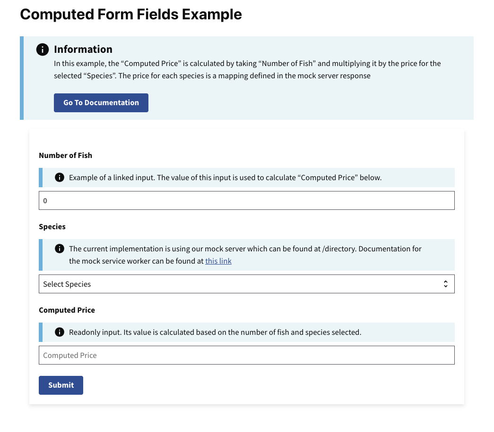

# Computed Form Fields Example

This example shows you how to build a form with computed form fields. Computed form fields automatically calculate a value based on a separate read-only field. For example, if a user inputs a quantity, a computed form field can multiply that number by a price to give a total cost. 

Learn more about RADFish examples at the official [documentation](https://nmfs-radfish.github.io/radfish/developer-documentation/examples-and-templates#examples). Refer to the [RADFish GitHub repo](https://nmfs-radfish.github.io/radfish/) for more information and code samples.

## Preview
This example will render as shown in this screenshot:



## Steps

### 1. Define Constants for Input Fields

Before building out your form, define constants for each input field. Using constants helps reduce errors and makes your logic more maintainable.

```jsx
const SPECIES = "species";
const NUMBER_OF_FISH = "numberOfFish";
const COMPUTED_PRICE = "computedPrice";
```

In this example, we will build a form with three inputs. The values from the first two inputs will compute the value of `computedPrice`.

### 2. Initialize the Form Component with State

Next, we'll define the main form component. To manage the data entered in the form, we initialize it with a `formData` state variable, which is an empty object. This state will dynamically store the values of the form fields as users interact with the form.

The `setFormData` function allows us to update the state whenever an input changes. This ensures the form data is kept in sync.

```jsx
const ComputedForm = () => {
    const [formData, setFormData] = useState({});

    return (
        // form JSX will go here
    );
};
```

### 3. Structuring the Form with Inputs

In the `return` statement of the component, use the Trussworks `Form` component to structure your form. Within the form, include input components such as `TextInput`, referencing the variables defined in Step 1 (e.g. `NUMBER_OF_FISH`) instead of hardcoding strings. This practice helps avoid typos and ensures consistency when accessing the `formData` state. For better organization and styling, wrap your inputs within the `FormGroup` component provided by Trussworks.

```jsx
return (
    <Form
        onSubmit={handleSubmit}
        className="maxw-full margin-205 padding-205 bg-white radius-8px shadow-2"
        >
        <FormGroup>
            <Label className="text-bold" htmlFor={NUMBER_OF_FISH}>
                Number of Fish
            </Label>
            <TextInput
                className="text-bold"
                id={NUMBER_OF_FISH}
                name={NUMBER_OF_FISH}
                type="number"
                placeholder="0"
                value={formData[NUMBER_OF_FISH] || ""}
            />
```

### 4. Adding Input Handlers for Form Fields

Use `handleNumberFishChange` and `handleSelectChange` to manage the state for the **Number of Fish** and **Species** fields. These functions update the `formData` state whenever the user interacts with the inputs.

For the **Number of Fish** input, the `handleNumberFishChange` function captures the input value and updates the corresponding field in the `formData` state. Similarly, the `handleSelectChange` function updates the state when the user selects a species.

This function handles changes in the **Number of Fish** input field:
```jsx
const handleNumberFishChange = (event, formData) => {
    const { value } = event.target;
    setFormData({
        ...formData, // Preserve existing form data
        [NUMBER_OF_FISH]: value, // Update the "Number of Fish" field
    });
};
```

Use the `handleNumberFishChange` function to manage the **Number of Fish** input:
```jsx
<TextInput
    className="text-bold"
    id={NUMBER_OF_FISH}
    name={NUMBER_OF_FISH}
    type="number"
    placeholder="0"
    value={formData[NUMBER_OF_FISH] || ""} // Display the current state value
    onChange={(event) => handleNumberFishChange(event, formData)} // Trigger the handler on change
/>
```

### 5. Calculating Computed Price

In addition to updating the input value of `numberOfFish`, we also want to update the value of `computedPrice`. We can do that by adding a helper function to run some logic to compute that value. We then call that helper function in the input's `onChange` handler:

This maps species to their respective prices:
```jsx
const speciesPriceMap = {
    grouper: 25.0,
    salmon: 58.0,
    marlin: 100.0,
    mahimahi: 44.0,
};
```

This function is kept outside the component since it doesn't rely on React state or lifecycle:
```jsx
const computeFieldValue = (numberOfFish, species) => {
    let computedPrice = parseInt(numberOfFish || 0) * parseInt(speciesPriceMap[species] || 0);
    return computedPrice.toString();
};
```

This function updates the **Number of Fish** and dynamically computes the "Computed Price":
```jsx 
const handleNumberFishChange = (event, formData) => {
    const { value } = event.target;
    setFormData({
        ...formData,
        [NUMBER_OF_FISH]: value,
        [COMPUTED_PRICE]: computeFieldValue(value, formData?.species || ""), // Compute and update the "Computed Price"
    });
};
```
