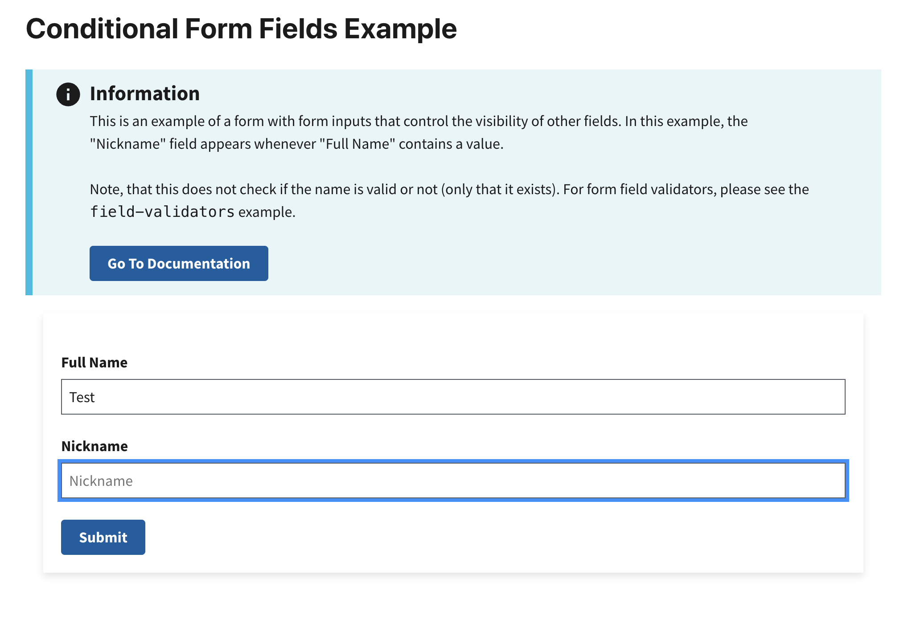

# Conditional Form Fields Example

This example shows you how to create a dynamic form with conditional fields. The visibility of certain input fields depends on the values of other fields.  Specifically, when the `fullName` field is filled out, the `nickname` field becomes visible. If the `fullName` field is empty, the `nickname` field is hidden and removed from the `formState`.

## Preview
This example will render as shown in this screenshot:




## Steps

### 1. Define Constants for Input Fields

Before building out your form, define constants for each input field. Using constants helps reduce errors and makes your logic more maintainable.

```jsx
const FULL_NAME = "fullName";
const NICKNAME = "nickname";
```

In this example, we will build a form with two inputs. The value from `FULL_NAME` inputs will control the visiblity of `NICKNAME`.

### 2. Initialize the Form Component with State

Next, we'll define the main form component. To manage the data entered in the form, we initialize it with a `formData` state variable, which is an empty object. This state will dynamically store the values of the form fields as users interact with the form.

The `setFormData` function allows us to update the state whenever an input changes. This ensures the form data is kept in sync.

```jsx
const ConditionalForm = () => {
    const [formData, setFormData] = useState({});

    return (
        // form JSX will go here
    );
};
```

### 3. Structuring the Form with Inputs

In the `return` statement of the component, use the Trussworks `Form` component to structure your form. Within the form, include input components such as `TextInput`, referencing the variables defined in Step 1 (e.g., `FULL_NAME`) instead of hardcoding strings. This practice helps avoid typos and ensures consistency when accessing the `formData` state. For better organization and styling, wrap your inputs within the `FormGroup` component provided by Trussworks.

```jsx
return (
    <Form
        onSubmit={handleSubmit}
        className="maxw-full margin-205 padding-205 bg-white radius-8px shadow-2"
    >
        <FormGroup>
            <Label className="text-bold" htmlFor={FULL_NAME}>
                Full Name
            </Label>
            <TextInput
                id={FULL_NAME}
                name={FULL_NAME}
                type="text"
                placeholder="Full Name"
                value={formData[FULL_NAME] || ""}
            />
```

### 4. Adding Input Handlers for Form Fields

Now we can create an `onChange` handler for each input. This captures the input's value as it is being typed. We'll use `handleFullNameChange` to update state with a copy of the existing `formState`, and update only the field value that we want to update. In this case, the value we want to update is `fullName`. The value of this input will then re-render with the updated value from `formState`.

This function handles changes in the **Full Name** input field:
```jsx
const handleFullNameChange = (event, formData) => {
    const { value } = event.target;
    setFormData({
        ...formData, // Preserve existing form data
        [FULL_NAME]: value, // Update the "Full Name" field
    });
};
```

Use the `handleFullNameChange` function to manage the **Full Name** input:
```jsx
<TextInput
    id={FULL_NAME}
    name={FULL_NAME}
    type="text"
    placeholder="Full Name"
    value={formData[FULL_NAME] || ""}
    onChange={(event) => handleFullNameChange(event, formData)} // Call the handleFullNameChange function to update the "Full Name" field
/>
```

### 5. Conditionally Render Nickname Field 

Next, we want to conditionally render the `nickname` component. The condition depends on whether or not the `fullName` value is set in `formState`. This input field will only render if `formData[FULL_NAME]` evaluates to `true`.

```jsx
{
    formData[FULL_NAME] && (
        <>
            <Label htmlFor={NICKNAME}>Nickname</Label>
            <TextInput
                id={NICKNAME}
                name={NICKNAME}
                type="text"
                placeholder="Nickname"
                value={formData[NICKNAME] || ""}
                onChange={(event) => handleNickNameChange(event, formData)}
            />
        </>
    )
}
```

### 6. Managing Dependent Field Values  

In this step, we ensure that the value of the **Nickname** field is cleared whenever the **Full Name** field is empty. Do this by adding logic to the `onChange` handler which calls the `handleFullNameChange` function.

```jsx
const handleFullNameChange = (event, formData) => {
    const { value } = event.target;
    setFormData({
        ...formData,
        [FULL_NAME]: value,
        [NICKNAME]: value === "" ? "" : formData[NICKNAME], // Clear the "Nickname" field if "Full Name" is empty
    });
};
```
