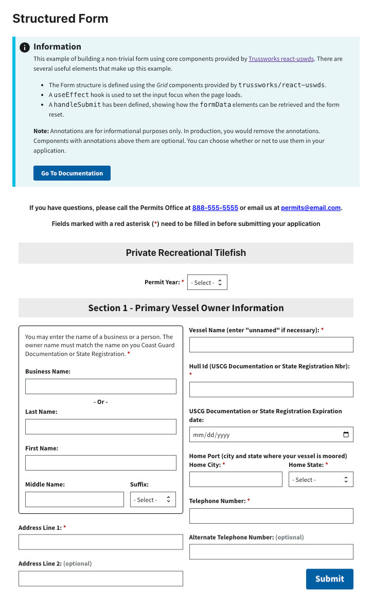

# Form Structure Example

This example shows you how to build a non-trivial form. It uses core components provided by [Trussworks react-uswds](https://github.com/trussworks/react-uswds). It is __not__ intended to show a full form implementation, such as sending a request on submit.

Learn more about RADFish examples at the official [documentation](https://nmfs-radfish.github.io/radfish/developer-documentation/examples-and-templates#examples). Refer to the [RADFish GitHub repo](https://nmfs-radfish.github.io/radfish/) for more information and code samples.

## Preview
This example will render as shown in this screenshot:



## Steps

### 1. Define the Page Structure

Use Trussworks `Grid` components to define the layout of your page in `src/pages/Home.jsx`. This approach helps organize content while maintaining a clean and responsive design.

#### Page structure with a single column:
```jsx
<GridContainer>
    <Grid row>
        <Grid col>
            <p className="text-bold text-center">
                Private Recreational Tilefish
            </p>
        </Grid>
    </Grid>
</GridContainer>
```

#### Aligning two inputs in a single row:
To place two input components side by side, use the `Grid` components. The `gap` property adds spacing between columns.

```jsx
<Grid row gap>
    <Grid col={8}>
        <Label htmlFor="middle-name" className="text-bold">Middle Name:</Label>
        <TextInput id="middle-name" name="middleName" />
    </Grid>
    <Grid col={4}>
        <Label htmlFor="suffix-select" className="text-bold"> Suffix: </Label>
        <Select id="suffix-select" name="suffixSelect" />
    </Grid>
</Grid>
```

### 2. Applying CSS Styles with `classNames`
For customized layout and styling, you can apply CSS through several approaches. Add CSS through component props, USWDS utility classes, and custom CSS classes.

#### Using Component Props
Many Trussworks components support built-in props for styling. For instance, the `gap` prop can control spacing between grid elements:

```jsx
<Grid row gap="md">
    {/* Content here */}
</Grid>
```

#### Using USWDS Utility Classes
Apply predefined USWDS utility classes to quickly style components without custom CSS:

```jsx
<Grid row className="flex-justify-center">
    {/* Content here */}
</Grid>
```

#### Using Custom CSS Classes
For advanced or project-specific styles, define custom CSS classes and apply them using the className attribute:

```jsx
<div className="app-input-boundary">
    {/* Content here */}
</div>
```

### 3. Setting Focus on Load and Reset
To enhance usability, the form sets focus on a specific input field both when the form loads and after it resets. To achieve this, use the `useRef` hook and React's `useEffect` to programmatically focus on the desired field.

```jsx
const inputFocus = useRef(null);

useEffect(() => {
    if (inputFocus.current) {
        inputFocus.current.focus(); // Set focus on the input field
    }
    setResetToggle(false); // Reset the toggle state
}, [resetToggle]);

<Select
    id="permit-year-select"
    name="permitYear"
    inputRef={inputFocus} //Attach the ref to the input field
/>
```

### 4. Display `FormData` Values on `Submit` and Reset the Form

When the form is submitted, the values of all fields are displayed, and the form is reset. This ensures that users receive feedback on their input. And, the form state is cleared for a new submission.

```jsx
const handleSubmit = (event) => {
    event.preventDefault();
    const formData = new FormData(event.target);
    const values = {};
    let alertString = '';

    for (const [key, value] of formData.entries()) {
        values[key] = value;
        alertString += `${key}: ${value}\n`;
    }

    window.alert(alertString);
    // Reset for after triggering Submit
    event.target.reset();
    // Set focus on first input after form is submitted.
    setResetToggle(true);
};
```
