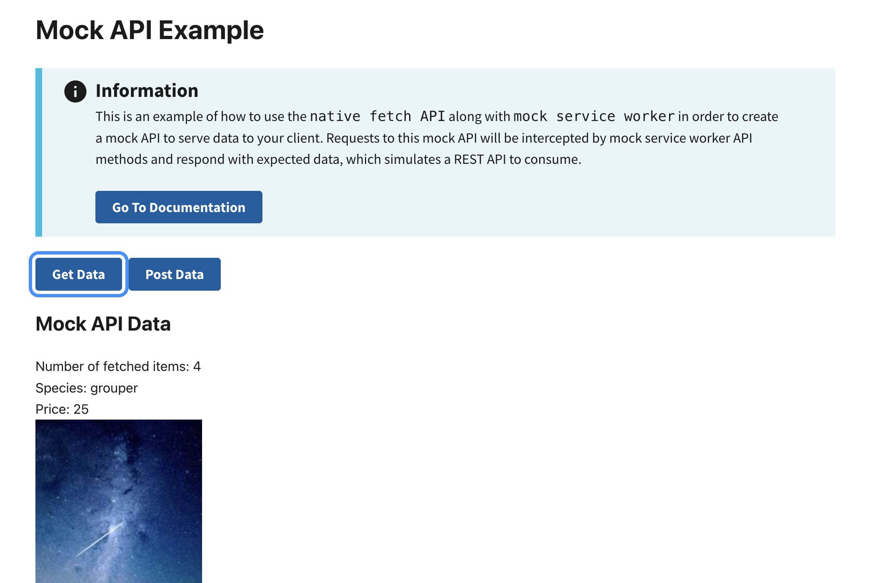

# Mock API Example

This example shows you how to use [Mock Service Worker](https://mswjs.io/) and the native `fetch` API. It builds out a mock API on the frontend to consume data without needing to rely on a backend system. This allows developers to use mock endpoints for testing while backend APIs are developed. Later, mock endpoints can easily be swapped out for production endpoints.

This example does __not__ include any backend persistence via IndexedDB. This is out of scope for this example. Instead, this example provides two simplified endpoints to call:

- `[GET] /species` returns a list of 4 species.
- `[POST] /species` returns the original list, with an additional species added (this is hard coded for simplicity).

Learn more about RADFish examples at the official [documentation](https://nmfs-radfish.github.io/radfish/developer-documentation/examples-and-templates#examples). Refer to the [RADFish GitHub repo](https://nmfs-radfish.github.io/radfish/) for more information and code samples.

## Preview
This example will render as shown in this screenshot:



## Steps

### 1. Enable Mocking in `index.jsx`

In the `index.jsx` file, enable mocking from the mock service worker. This ensures that your mock API is being called while in development.

```jsx
import React from "react";
import ReactDOM from "react-dom/client";
import "./styles/theme.css";
import App from "./App";

// Enable the mock service worker
async function enableMocking() {
    const { worker } = await import("./mocks/browser");
    const onUnhandledRequest = "bypass"; // Ignore unhandled requests to prevent errors in development

    if (import.meta.env.MODE === "development") {
        return worker.start({
            onUnhandledRequest,
            serviceWorker: {
                url: `/mockServiceWorker.js`, // Path to the mock service worker
            },
        });
    }

    // For non-development environments, fallback to a different service worker
    return worker.start({
        onUnhandledRequest,
        serviceWorker: {
            url: `/service-worker.js`,
        },
    });
}

const root = ReactDOM.createRoot(document.getElementById("root"));

enableMocking().then(() => {
    root.render(
        <React.StrictMode>
            <App />
        </React.StrictMode>,
    );
});
```

**Key Points:**

- Ensure the `mockServiceWorker.js` file is present in the `src` directory.
- This setup dynamically starts the service worker based on the environment.

### 2. Create the Mocks Directory

1. Create a `mocks` directory in `src`.
2. Create `browser.js` and `handlers.js` files.

### 3. Define Mock Endpoints in `browser.js`

The `browser.js` file will import the endpoints configured in the `handlers.js` file. It wraps them in a higher order function from the `msw/browser` library. This sets up mock endpoints and intercepts them when getting called from the client:

```js
// src/mocks/browser.js
import { setupWorker } from "msw/browser";
import { handlers } from "./handlers";

// Configure the mock service worker with the handlers
export const worker = setupWorker(...handlers);
```

**Explanation:**

- `setupWorker` initializes the service worker.
- Spread the `handlers` array to register mock endpoints.

### 4. Configure Endpoints in `handlers.js`

You can setup any endpoints that you want to mock within `handlers.js`. Be sure to export these handlers so that they can be imported into `browser.js` appropriately:

```js
import { http, HttpResponse } from "msw";

export const MSW_ENDPOINT = {
    SPECIES: "/species", // Endpoint for fetching fish species
};

export const species = [
    { name: "grouper", price: 25.0, src: "./sample-img.jpg" },
    { name: "salmon", price: 58.0, src: "./sample-img.jpg" },
    { name: "marlin", price: 100.0, src: "./sample-img.jpg" },
    { name: "mahimahi", price: 44.0, src: "./sample-img.jpg" },
];

// Mock API handlers
export const handlers = [
    // GET endpoint: Fetch list of species
    // This implementation can/should change depending on your needs
    http.get(MSW_ENDPOINT.SPECIES, () => {
        return HttpResponse.json(
            {
                data: species,
            },
            { status: 200 },
        );
    }),

    // POST endpoint: Add a new species
    // In a full stack implementation, there will likely be some logic on the server to handle/store persistent data
    http.post(MSW_ENDPOINT.SPECIES, async ({ request }) => {
        const requestData = await request.json();
        const response = [requestData.data, ...species];

        return HttpResponse.json({ data: response }, { status: 201 });
    }),
];
```

### 5. Access Mock Endpoints with Fetch

You can now use these endpoints in your application by making HTTP requests with the native `fetch` API.

**GET Request Example**

Fetch the list of fish species:

```jsx
import { MSW_ENDPOINT } from "./mocks/handlers";

const getRequestWithFetch = async (endpoint) => {
    try {
        const response = await fetch(`${endpoint}`, {
            headers: {
                "X-Access-Token": "your-access-token",
            },
        });

        if (!response.ok) {
            const error = await response.json();
            return error;
        }

        const data = await response.json();
        return data;
    } catch (err) {
        const error = `[GET]: Error fetching data: ${err}`;
        return error;
    }
};

// [GET] /species
const { data } = await getRequestWithFetch(MSW_ENDPOINT.SPECIES);
```

**POST Request Example**

Add a new species to the mock database:

```jsx
const postRequestWithFetch = async (endpoint, submittedData) => {
    try {
        const response = await fetch(endpoint, {
            method: "POST",
            headers: {
                "Content-Type": "application/json",
                "X-Access-Token": "your-access-token",
            },
            body: JSON.stringify({
                ...submittedData,
            }),
        });

        if (!response.ok) {
            const error = await response.json();
            return error;
        }

        const data = await response.json();
        return data;
    } catch (err) {
        const error = `[GET]: Error fetching data: ${err}`;
        return error;
    }
};

// [POST] /species
const { data } = await postRequestWithFetch(MSW_ENDPOINT.SPECIES, {
    data: {
        name: "tuna",
        price: 75,
        src: "./sample-img.jpg",
    },
});
```
