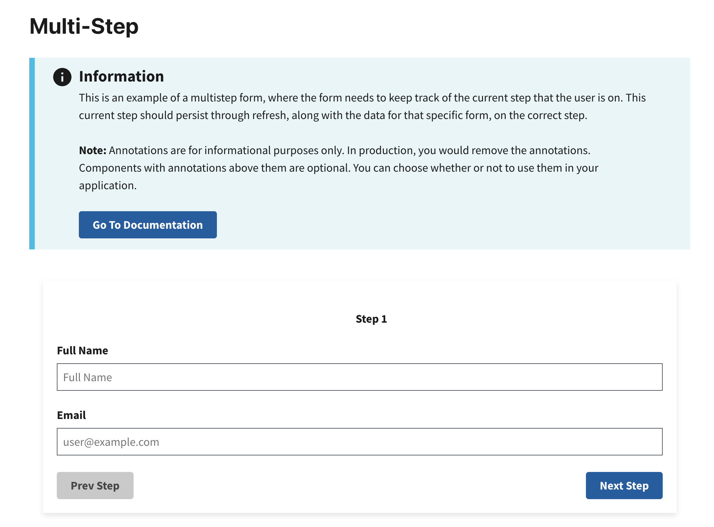

# Multistep Form Example

This example demonstrates how to create a multi-step form with persistent state using RADFish's storage system. Each step in the form is encapsulated within its own `FormGroup`. The form tracks the user's progress through RADFish's Application and Collection patterns.

## Key RADFish Concepts

- **Application Instance**: Configured in `index.jsx` with stores and collections
- **Collections**: Provide structured data storage with schema validation
- **Step-based Persistence**: Form data is saved when navigating between steps
- **Session Resumption**: Users return to their last step with all data intact

The form uses RADFish's IndexedDB storage to persist both the current step and all form data. When users revisit the form, they see their previously entered data and resume at their saved step.

Learn more about RADFish examples at the official [documentation](https://nmfs-radfish.github.io/radfish/developer-documentation/examples-and-templates#examples). Refer to the [RADFish GitHub repo](https://nmfs-radfish.github.io/radfish/) for more information and code samples.

## Preview
This example will render as shown in this screenshot:



## Steps

### 1. Define the Total Number of Steps
Declare the total number of steps for your multi-step form using a constant variable. This allows you to control the flow and logic of the form.

```jsx
const TOTAL_STEPS = 2;
```

This declaration ensures the form knows how many steps are included. This helps manage navigation between steps.

### 2. Configure the Application Schema
In `index.jsx`, define the schema for your form data. This schema validates and structures your data:

```jsx
const app = new Application({
  stores: {
    formData: {
      connector: new IndexedDBConnector("multistep-form-app"),
      collections: {
        formData: {
          schema: {
            fields: {
              id: { type: "string", primaryKey: true },
              fullName: { type: "string" },
              email: { type: "string" },
              city: { type: "string" },
              state: { type: "string" },
              zipcode: { type: "string" },
              currentStep: { type: "number" },
              totalSteps: { type: "number" },
              submitted: { type: "boolean" },
            },
          },
        },
      },
    },
  },
});
```

Key schema concepts:
- **primaryKey**: The `id` field uniquely identifies each form
- **Field types**: Define the expected data type for validation
- **Form state fields**: `currentStep`, `totalSteps`, and `submitted` track form progress

### 3. Access the RADFish Collection

First, in `Home.jsx`, access the formData collection using the RADFish Application pattern:

```jsx
// Get the application instance and access the formData collection
const application = useApplication();
const formDataCollection = application.stores.formData.getCollection("formData");
```

### 4. Initialize Multi-Step Form

Create a new form entry with a unique ID for persistence:

```jsx
const handleInit = async () => {
    const newForm = {
        id: crypto.randomUUID(),
        currentStep: 1,
        totalSteps: TOTAL_STEPS,
        submitted: false,
    };
    await formDataCollection.create(newForm);
    setFormData(newForm);
    navigate(`/${newForm.id}`); // Navigate to the form using its unique ID
};
```
This function:
- Creates a new form with a unique `id` using `crypto.randomUUID()`
- Initializes the form at step 1 with the total number of steps
- Uses the collection's `create()` method to persist the form
- Navigates to the form's unique URL

### 5. Create Navigation Helper Functions
Define helper functions to navigate between steps. These functions save all form data when moving between steps, ensuring data persistence without saving on every keystroke:

```jsx
// Navigate to next step and persist all form data
const stepForward = async () => {
    if (formData.currentStep < TOTAL_STEPS && id) {
        const nextStep = formData.currentStep + 1;
        const updatedData = { ...formData, currentStep: nextStep };
        setFormData(updatedData);
        
        // Save form data when navigating to next step
        try {
            await formDataCollection.update({ id: id, ...updatedData });
        } catch (error) {
            console.error("Failed to save form progress:", error);
        }
    }
};

// Navigate to previous step and persist all form data
const stepBackward = async () => {
    if (formData.currentStep > 1 && id) {
        const prevStep = formData.currentStep - 1;
        const updatedData = { ...formData, currentStep: prevStep };
        setFormData(updatedData);
        
        // Save form data when navigating to previous step
        try {
            await formDataCollection.update({ id: id, ...updatedData });
        } catch (error) {
            console.error("Failed to save form progress:", error);
        }
    }
};
```

These functions:
- Update the current step in the form state
- Save all form data (including user inputs) when navigating
- Ensure data persists across sessions without excessive database writes
- Handle errors gracefully if the save operation fails

### 6. Load Form Data from the URL Parameter
Subscribe to the `id` parameter in the URL to load the correct form data:

```jsx
const { id } = useParams();

// Load existing form data when navigating to a form by ID
useEffect(() => {
    const loadData = async () => {
        if (id) {
            const [found] = await formDataCollection.find({
                id: id, // Query the collection using the form ID
            });

            if (found) {
                setFormData({ ...found, id: id, totalSteps: TOTAL_STEPS }); // Load the data into state
            } else {
                navigate("/"); // Redirect to the root if no data is found
            }
        }
    };
    loadData();
}, [id]);
```
This ensures:

- The form resumes at the correct step when the user revisits the page
- Invalid or missing IDs redirect users to start a new form
- All previously entered data is restored


### 7. Handle Form Input Changes
Implement a simple change handler to update form state as users type:

```jsx
// Update form data in state as user types
const handleChange = (event) => {
    const { name, value } = event.target;
    setFormData((prev) => ({ ...prev, [name]: value }));
};
```

Note: Form data is persisted when users navigate between steps or submit the form, not on every keystroke. This approach reduces database writes while still ensuring data persistence.

### 8. Render the Current Step Dynamically 
Use the `formData.currentStep` value to conditionally render the correct form step. This allows you to show only the relevant inputs for the current step while keeping the form flexible.

```jsx
{
    formData.currentStep === 1 && (
        <FormGroup>
            <Label htmlFor={fullName}>Full Name</Label>
            <TextInput
                id={fullName}
                name={fullName}
                type="text"
                placeholder="Full Name"
                value={formData[fullName] || ""}
                onChange={handleChange}
            />
            <Label htmlFor={fullName}>Email</Label>
            <TextInput
                id={email}
                name={email}
                type="text"
                placeholder="user@example.com"
                value={formData[email] || ""}
                onChange={handleChange}
            />

            <Grid className="display-flex flex-justify">
                <Button
                    type="button"
                    className="margin-top-1 margin-right-0 order-last"
                    onClick={stepForward}
                >
                    Next Step
                </Button>
                <Button
                    disabled
                    type="button"
                    className="margin-top-1"
                    onClick={stepBackward}
                    data-testid="step-backward"
                    id="step-backward"
                >
                    Prev Step
                </Button>
            </Grid>
        </FormGroup>
    )
}
```
**Key Points:**

- `stepForward` moves to the next step, while `stepBackward` goes to the previous step.
- The "Prev Step" button is disabled on the first step to prevent invalid navigation.
- The form dynamically updates based on the `currentStep` value.

