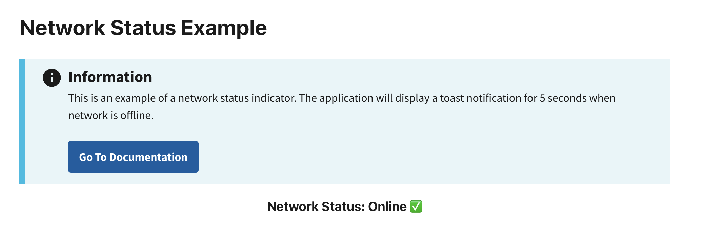

# Network Status Example

This example demonstrates how to detect a user's network connectivity. If the user is offline, the built-in status indicator will display `Offline ❌`. If online, it will show `Online ✅`.

The `useOfflineStatus` hook provides an `isOffline` utility that detects the user's network connectivity. It uses the `navigator` browser API. Refer to the [MDN Navigator Docs](https://developer.mozilla.org/en-US/docs/Web/API/Navigator) for limitations.

## Preview

This example will render as shown in this screenshot:



## Steps

### 1. Import Required Dependencies

Import the following libraries in the `App.jsx` file:

```jsx
import React, { useEffect } from "react";
import { useOfflineStatus } from "@nmfs-radfish/react-radfish";
import { Alert } from "@trussworks/react-uswds";
```

### 2. Use `useOfflineStatus` to Access Network State

Within the `HomePage` component, use `useOfflineStatus` to retrieve the `isOffline` property, which indicates whether the application is currently offline:

```jsx
const HomePage = () => {
    const { isOffline } = useOfflineStatus();  // Retrieve the isOffline state

    return (
        <div className="grid-container">
            <h1>Network Status Example</h1>
            <h3 className="header-body">Network Status: {isOffline ? "Offline ❌" : "Online ✅"}</h3>
        </div>
    );
};
```
