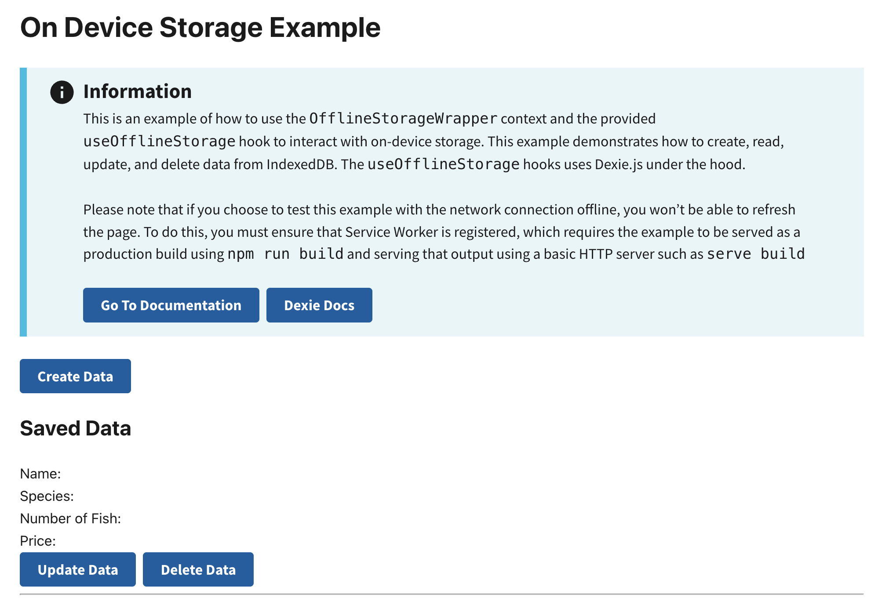

# On-Device Storage Example

This example demonstrates how to use RADFish's storage system with IndexedDB for on-device data persistence. It showcases the Application and Collection patterns for managing structured data with schema validation.

## Key RADFish Concepts

- **Application Instance**: Configured with stores and collections
- **Schema-based Storage**: Type-safe data validation
- **Collection API**: Consistent CRUD operations
- **IndexedDB Integration**: Automatic persistence with offline support

Use cases include:
- Offline on-device data storage (most cases)
- Local non-relational database (online or offline use)
- Form data persistence across sessions
- Structured data with validation

## Preview
This example will render as shown in this screenshot:



## Steps

### 1. Configure RADFish Application with Schema
In the `index.jsx` file, define your Application with stores and schemas:

```jsx
import { Application } from "@nmfs-radfish/radfish";
import { IndexedDBConnector } from "@nmfs-radfish/radfish/storage";

const app = new Application({
  stores: {
    fishingData: {
      connector: new IndexedDBConnector("on-device-storage-app"),
      collections: {
        formData: {
          schema: {
            fields: {
              id: { type: "string", primaryKey: true },
              fullName: { type: "string" },
              email: { type: "string" },
              phoneNumber: { type: "string" },
              numberOfFish: { type: "number" },
              species: { type: "string" },
              computedPrice: { type: "number" },
              isDraft: { type: "boolean" },
            },
          },
        },
        species: {
          schema: {
            fields: {
              id: { type: "string", primaryKey: true },
              name: { type: "string" },
              price: { type: "number" },
            },
          },
        },
      },
    },
  },
});
```

Key schema concepts:
- **Primary Key**: Each collection must have a field marked as `primaryKey: true`
- **Field Types**: Ensures data validation (string, number, boolean)
- **Multiple Collections**: Organize related data in separate collections

### 2. Initialize and Provide the Application Instance
The Application waits for stores to be ready before rendering:

```jsx
const root = ReactDOM.createRoot(document.getElementById("root"));

app.on("ready", () => {
  root.render(
    <ErrorBoundary>
      <React.StrictMode>
        <App application={app} />
      </React.StrictMode>
    </ErrorBoundary>,
  );
});
```

The `App` component wraps children with the `Application` context provider:

```jsx
const App = ({ application }) => {
  return (
    <Application application={application}>
      <div className="App grid-container">
        <Router>
          <Routes>
            <Route path="/" element={<HomePage />} />
          </Routes>
        </Router>
      </div>
    </Application>
  );
};
```

## Using Collections in Components

### Access Collections with `useApplication` Hook

In any component within the Application context, access collections using the `useApplication` hook:

```jsx
import { useApplication } from "@nmfs-radfish/react-radfish";

const HomePage = () => {
  const application = useApplication();
  const formDataCollection = application.stores.fishingData.getCollection("formData");
  
  // Use collection methods...
};
```

### Collection API Methods

Collections provide the following methods for data operations:

#### Create
```jsx
const newData = {
  id: crypto.randomUUID(),
  fullName: "John Doe",
  species: "Tuna",
  numberOfFish: 3,
  computedPrice: 150,
  isDraft: false
};

await formDataCollection.create(newData);
```

#### Find
```jsx
// Find all records
const allData = await formDataCollection.find();

// Find with criteria
const draftRecords = await formDataCollection.find({ isDraft: true });
```

#### Update
```jsx
const updatedData = {
  id: "existing-id",
  fullName: "Jane Doe",
  numberOfFish: 5,
  // ... other fields
};

await formDataCollection.update(updatedData);
```

#### Delete
```jsx
// Delete by ID
await formDataCollection.delete({ id: "record-id" });
```

All methods are type-safe and validate data against the schema defined in your Application configuration.

