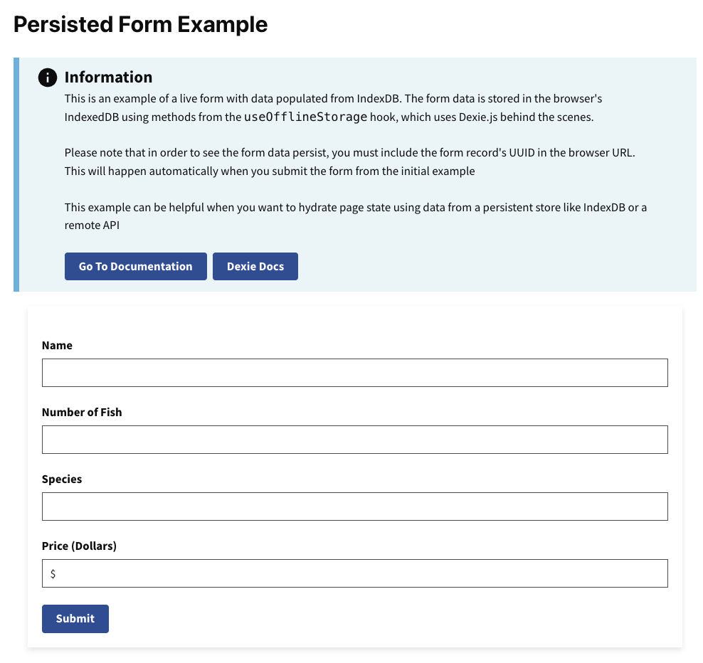

# Persisted Form Example

This example demonstrates how to create a persistent form using RADFish's Application and Collection patterns. The form automatically saves data to IndexedDB with schema validation, allowing users to return to their form at any time.

## Key RADFish Concepts

- **Application Instance**: Configured with stores and collections for structured data management
- **Schema Validation**: Type-safe form fields with automatic validation
- **Collection API**: Consistent CRUD operations for form data persistence
- **URL-based Loading**: Forms can be bookmarked and shared via unique URLs

Use cases include:
- Contact forms that save progress automatically
- Survey forms with complex validation requirements
- Data entry forms that need offline persistence
- Any form where data loss prevention is critical

Learn more about RADFish examples at the official [documentation](https://nmfs-radfish.github.io/radfish/developer-documentation/examples-and-templates#examples). Refer to the [RADFish GitHub repo](https://nmfs-radfish.github.io/radfish/) for more information and code samples.

## Preview
This example will render as shown in this screenshot:



## Steps

### 1. Configure RADFish Application with Schema
In the `index.jsx` file, define your Application with stores and schema validation:

```jsx
import { Application } from "@nmfs-radfish/radfish";
import { IndexedDBConnector } from "@nmfs-radfish/radfish/storage";

const app = new Application({
  serviceWorker: {
    url: import.meta.env.MODE === "development" ? "/mockServiceWorker.js" : "/service-worker.js",
  },
  stores: {
    formData: {
      connector: new IndexedDBConnector("persisted-form-app"),
      collections: {
        formData: {
          schema: {
            fields: {
              id: { type: "string", primaryKey: true },
              fullName: { type: "string" },
              numberOfFish: { type: "number" },
              species: { type: "string" },
              computedPrice: { type: "number" },
              isDraft: { type: "boolean" },
            },
          },
        },
      },
    },
  },
});
```

Key schema features:
- **Primary Key**: Each form has a unique `id` for URL-based loading
- **Type Validation**: Numbers are automatically validated and converted
- **Boolean Flags**: Track form state (draft vs. completed)

### 2. Initialize and Provide the Application
The Application waits for stores to be ready before rendering:

```jsx
const root = ReactDOM.createRoot(document.getElementById("root"));

app.on("ready", async () => {
  root.render(
    <ErrorBoundary>
      <React.StrictMode>
        <App application={app} />
      </React.StrictMode>
    </ErrorBoundary>,
  );
});
```

### 3. Access Collections in Components
In your form components, use the `useApplication` hook to access collections:

```jsx
import { useApplication } from "@nmfs-radfish/react-radfish";

const HomePage = () => {
  const application = useApplication();
  const formDataCollection = application.stores.formData.getCollection("formData");
  
  // Use collection methods for CRUD operations...
};
```

### 4. Implement Form Persistence
The form demonstrates several key persistence patterns:

#### Creating New Forms
```jsx
const handleSubmit = async (e) => {
  e.preventDefault();
  // Extract form values...
  
  if (!id) {
    // Create new form with unique ID
    const newForm = {
      id: crypto.randomUUID(),
      ...values,
      isDraft: false,
    };
    await formDataCollection.create(newForm);
    navigate(`/${newForm.id}`); // Navigate to shareable URL
  }
};
```

#### Loading Existing Forms
```jsx
const findExistingForm = async () => {
  if (id) {
    const [found] = await formDataCollection.find({ id: id });
    if (found) {
      setFormData({ ...found });
    } else {
      navigate("/"); // Redirect if form not found
    }
  }
};
```

#### Updating Forms
```jsx
// Update existing form
const updatedForm = { id, ...values, isDraft: false };
await formDataCollection.update(updatedForm);
```

### 5. Key Features Demonstrated
- **URL-based Form Loading**: Each form gets a unique URL for bookmarking and sharing
- **Type Safety**: Number fields are automatically converted and validated
- **Auto-save on Submit**: Data persists across browser sessions
- **Schema Validation**: Form data structure is enforced by the collection schema

