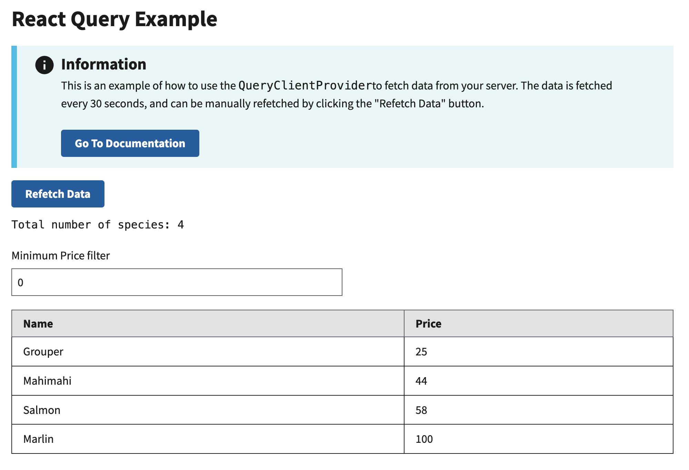

# React Query Example

This example shows you how to use the [React Query library](https://tanstack.com/query/latest) to manage state in your application.

This example does __not__ include any backend persistence via IndexedDB. as this is out of scope for this example. Instead, this example provides two simplified endpoints to call:

- `[GET] /species` returns a list of 4 species

Learn more about RADFish examples at the official [documentation](https://nmfs-radfish.github.io/radfish/developer-documentation/examples-and-templates#examples). Refer to the [RADFish GitHub repo](https://nmfs-radfish.github.io/radfish/) for more information and code samples.

## Preview
This example will render as shown in this screenshot:

