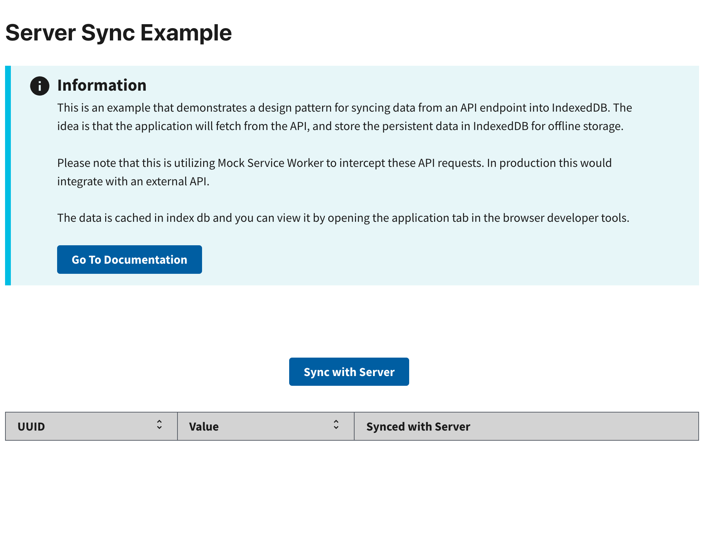

# Server Sync Example

This example demonstrates server-to-client data synchronization using RADFish's Application and Collection patterns. It shows how to fetch data from an API, compare it with local data, and persist updates in IndexedDB with schema validation.

## Key RADFish Concepts

- **Application Instance**: Configured with stores and collections for data management
- **Schema Validation**: Type-safe collections ensure data integrity
- **Offline Detection**: Built-in network status monitoring and appropriate user feedback
- **Smart Synchronization**: Only updates local data when server data differs

Use cases include:
- Periodic data synchronization from APIs
- Offline-first applications with server backup
- Data caching for improved performance
- Background sync processes

## Features

- Synchronizes data with a remote server.
- Handles offline status and provides appropriate messages.
- Provides a loading state during synchronization.
- Displays the last synchronization time.

## Preview

This example will render as shown in this screenshot:



## Steps

### 1. Configure Application Schema
In `index.jsx`, define your Application with stores and collections for sync data:

```jsx
import { Application } from "@nmfs-radfish/radfish";
import { IndexedDBConnector } from "@nmfs-radfish/radfish/storage";

const app = new Application({
  stores: {
    syncData: {
      connector: new IndexedDBConnector("server-sync-app"),
      collections: {
        localData: {
          schema: {
            fields: {
              id: { type: "string", primaryKey: true },
              value: { type: "string" },
              isSynced: { type: "boolean" },
            },
          },
        },
        lastSyncFromServer: {
          schema: {
            fields: {
              id: { type: "string", primaryKey: true },
              time: { type: "number" },
            },
          },
        },
      },
    },
  },
});
```

Key schema design:
- **localData**: Stores the actual data synchronized from the server
- **lastSyncFromServer**: Tracks synchronization timestamps
- **Primary Keys**: Each collection uses `id` as the unique identifier

### 2. Access Collections and Status
Import RADFish utilities and access your collections:

```jsx
import { useOfflineStatus, useApplication } from "@nmfs-radfish/react-radfish";

const { isOffline } = useOfflineStatus();
const application = useApplication();
const localDataCollection = application.stores.syncData.getCollection("localData");
const lastSyncCollection = application.stores.syncData.getCollection("lastSyncFromServer");
```

#### Key utilities:
- **useOfflineStatus**: Provides real-time network connectivity status
- **useApplication**: Accesses the Application instance and its collections
- **Collections**: Type-safe interfaces for data operations

### 3. Define Helper Functions

Create helper functions to make network requests and fetch data from an API endpoint.

#### `getRequestWithFetch`

This function performs GET requests and handles errors:

```jsx
const getRequestWithFetch = async (endpoint) => {
  try {
    const response = await fetch(`${endpoint}`, {
      headers: { "X-Access-Token": "your-access-token" },
    });

    if (!response.ok) {
      const error = await response.json();
      return error;
    }

    return await response.json();
  } catch (err) {
    return { error: `[GET]: Error fetching data: ${err}` };
  }
};
```

### 4. Implement Server Synchronization

The `syncToServer` function demonstrates complete server-to-client synchronization using Collections:

```jsx
const syncToServer = async () => {
  if (isOffline) {
    setSyncStatus({ message: SERVER_SYNC_FAILED, lastSynced: syncStatus.lastSynced });
    return;
  }

  setIsLoading(true);
  try {
    // Fetch data from the server
    const { data: serverData } = await getRequestWithFetch(MSW_ENDPOINT.GET);

    // Retrieve existing local data
    const offlineData = await localDataCollection.find();

    // Compare server data with local data
    if (JSON.stringify(offlineData) !== JSON.stringify(serverData)) {
      // Clear existing local data
      const existingData = await localDataCollection.find();
      for (const item of existingData) {
        await localDataCollection.delete({ id: item.id });
      }
      
      // Insert new server data with proper schema mapping
      for (const item of serverData) {
        await localDataCollection.create({
          id: item.uuid || crypto.randomUUID(),
          value: item.value,
          isSynced: item.isSynced || true,
        });
      }

      // Update sync timestamp
      const currentTimestamp = Date.now();
      const existingSync = await lastSyncCollection.find({ id: "lastSynced" });
      
      if (existingSync.length > 0) {
        await lastSyncCollection.update({ id: "lastSynced", time: currentTimestamp });
      } else {
        await lastSyncCollection.create({ id: "lastSynced", time: currentTimestamp });
      }

      const lastSyncTime = new Date(currentTimestamp).toLocaleString();
      setSyncStatus({ message: SERVER_SYNC_SUCCESS, lastSynced: lastSyncTime });
      
      // Refresh UI data
      const updatedData = await localDataCollection.find();
      setData(updatedData);
    } else {
      setSyncStatus({ message: OFFLINE_ALREADY_SYNCED, lastSynced: syncStatus.lastSynced });
    }
  } catch (error) {
    console.error("Sync error:", error);
    setSyncStatus({ message: "Sync failed due to an error.", lastSynced: syncStatus.lastSynced });
  } finally {
    setIsLoading(false);
  }
};
```

**Key synchronization steps**:
- **Offline Check**: Prevents sync attempts when network is unavailable
- **Data Comparison**: Only updates when server data differs from local data
- **Schema Mapping**: Transforms server data to match local collection schema
- **Timestamp Tracking**: Records successful sync times for user feedback

### 5. Load and Display Sync Status

Load the last synchronization time from the collection and update the UI:

```jsx
useEffect(() => {
  const loadLastSyncedTime = async () => {
    const [lastSyncRecord] = await lastSyncCollection.find({ id: "lastSynced" });
    if (lastSyncRecord?.time) {
      const lastSyncTime = new Date(lastSyncRecord.time).toLocaleString();
      setSyncStatus((prev) => ({
        ...prev,
        lastSynced: lastSyncTime,
      }));
    }
  };

  loadLastSyncedTime();
}, [isOffline, lastSyncCollection]);
```

### 6. Render the Component

The complete component demonstrates sync functionality with user feedback:

```jsx
export const HomePage = () => {
  const { isOffline } = useOfflineStatus();
  const application = useApplication();
  const localDataCollection = application.stores.syncData.getCollection("localData");
  const lastSyncCollection = application.stores.syncData.getCollection("lastSyncFromServer");
  
  const [isLoading, setIsLoading] = useState(false);
  const [syncStatus, setSyncStatus] = useState({ message: "", lastSynced: "" });
  const [data, setData] = useState([]);

  return (
    <>
      <h1>Server Sync Example</h1>
      <Alert type="info">
        This example demonstrates server synchronization with offline detection.
        Use DevTools Network tab to toggle offline mode and test sync behavior.
      </Alert>
      
      <div className="server-sync">
        <Button onClick={syncToServer} disabled={isLoading}>
          {isLoading ? <Spinner width={20} height={20} stroke={2} /> : "Sync with Server"}
        </Button>
        
        <div className={`${syncStatus.message.includes("offline") ? "text-red" : "text-green"} margin-left-2 margin-top-2`}>
          {syncStatus.message}
        </div>
        
        <div className="margin-left-2">
          {syncStatus.lastSynced && (
            <strong>Last Synced: {syncStatus.lastSynced}</strong>
          )}
        </div>
        
        <Table
          data={data}
          columns={[
            { key: "id", label: "ID", sortable: true },
            { key: "value", label: "Value", sortable: true },
            { key: "isSynced", label: "Synced with Server", sortable: false },
          ]}
        />
      </div>
    </>
  );
};
```

Note that the table now uses `id` instead of `uuid` to match the new schema.

### 7. Test Offline/Online Behavior

Verify that the application handles network connectivity changes correctly:

#### Enable Offline Mode
1. Open browser **Developer Tools** (`F12`)
2. Navigate to the **Network** tab
3. Find the **Throttling** dropdown
4. Select **Offline** to simulate network disconnection

#### Test Sync Behavior
1. **Offline Test**: Click "Sync with Server" - should show error message
2. **Online Test**: Change throttling back to "No throttling" and sync again
3. **Data Verification**: Check Application > IndexedDB in DevTools to see stored data

#### Expected Results
- **Offline**: Error message appears, no data changes
- **Online**: Success message, data updates if different from server
- **Data Persistence**: All synchronized data persists in IndexedDB collections
- **Schema Validation**: Data follows the defined collection schemas

This example demonstrates how RADFish's Collections provide a robust foundation for building offline-first applications with server synchronization capabilities.
