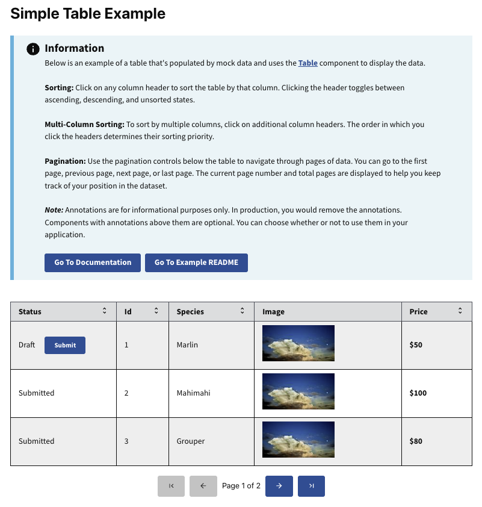

# Simple Table Example

This example shows you how to use the `<Table>` component to display tabular data.

Learn more about RADFish examples at the official [documentation](https://nmfs-radfish.github.io/radfish/developer-documentation/examples-and-templates#examples). Refer to the [RADFish GitHub repo](https://nmfs-radfish.github.io/radfish/) for more information and code samples.

## Table Overview

The `<Table>` component is flexible and customizable. It lets you define column configurations, enable sorting, and paginate large datasets. In this example, we use mock data representing different fish species with attributes such as status (draft/submitted), UUID, species name, image, and price.

## Features

- **Sorting**: Click on any column header to sort the table by that column. Sorting toggles between ascending, descending, and unsorted states.
- **Multi-Column Sorting**: Multi-column sorting allows you to sort data by multiple columns. Click additional column headers in the desired order of sorting priority.
- **Pagination**: Use the pagination controls below the table to navigate through multiple pages of data. You can move between the first, previous, next, and last page, and see the current page number and total pages.
- **Custom Rendering**: Certain columns (like the image and price) use custom render functions to display data in a more user-friendly way.
- **Status Submission**: Rows with a "Draft" status display a "Submit" button, which updates the status to "Submitted" when clicked.

## Preview
This example will render as shown in this screenshot:



## Steps

### 1. Data Structure

The `data` prop is an array of objects where each object represents a row in the table. Each object should have keys that correspond to the `key` values defined in your `columns` array.

```jsx
const mockData = [
    {
        uuid: "1",
        isDraft: true,
        species: "Marlin",
        price: 50,
        image: "./sample-img.webp",
    },
    {
        uuid: "2",
        isDraft: false,
        species: "Mahimahi",
        price: 100,
        image: "./sample-img.webp",
    },
    // More data...
];
```

### 2. Columns Configuration

The `columns` array defines how the table displays and interacts with the data. Each column object can include:

- **`key`**: (string) A unique identifier that matches a key in your data object.
- **`label`**: (string) The header text displayed for the column.
- **`sortable`**: (boolean) A boolean that determines whether sorting is enabled for this column.
- **`render`**: (function) _(Optional)_ A function that customizes how data is displayed in that column.
- **`className`**: (string) _(Optional)_ For custom styling.

```jsx
const columns = [
    {
        key: "isDraft",
        label: "Status",
        sortable: true,
        render: (row) => (
            <span>
                {row.isDraft ? "Draft" : "Submitted"}
                {row.isDraft && <Button onClick={(e) => handleSubmit(e, row)}>Submit</Button>}
            </span>
        ),
    },
    {
        key: "uuid",
        label: "ID",
        sortable: true,
    },
    {
        key: "species",
        label: "Species",
        sortable: true,
    },
    {
        key: "price",
        label: "Price",
        sortable: true,
        render: (row) => <strong>${row.price}</strong>,
    },
    {
        key: "image",
        label: "Image",
        render: (row) => ,
    },
];
```

### 3. Custom Rendering with render

Use the `render` function to customize how data is displayed in a column. This is useful for rendering components like buttons or images.

- Rendering a Button:

  ```jsx
  {
      key: "isDraft",
      label: "Status",
      render: (row) => (
          <span>
              {row.isDraft ? "Draft" : "Submitted"}
              {row.isDraft && (
                  <Button onClick={(e) => handleSubmit(e, row)}>
                      Submit
                  </Button>
              )}
          </span>
      ),
  },
  ```

- Rendering an Image:

  ```jsx
  {
      key: "image",
      label: "Image",
      render: (row) => (
          
      ),
  },
  ```

### 4. Pagination

Control table pagination using the `paginationOptions` prop.

Pagination Options:

- `pageSize`: (number) Number of rows displayed per page.
- `currentPage`: (number) The current page number (starting from 1).
- `totalRows`: (number) Total number of rows in your dataset.
- `onPageChange`: (function) Function called when the page changes.

```jsx
const paginationOptions = {
    pageSize: 5,
    currentPage: 1,
    onPageChange: onPageChange,
    totalRows: data.length,
};
```

### 5. Additional Props and Styling

Our `<Table>` component is built on the Trussworks `<Table>` component from the `@trussworks/react-uswds` library. This integration lets you use additional props to customize its appearance and behavior.

#### Using Trussworks Props

You can pass these props directly to the `<Table>` component to enhance its styling:

```jsx
<Table
    data={data}
    columns={columns}
    paginationOptions={paginationOptions}
    className="my-custom-table"
    striped
    bordered
/>
```

#### Referencing Trussworks Documentation

For a complete list of available props and detailed descriptions, refer to the [Trussworks Table Component Documentation](https://trussworks.github.io/react-uswds/?path=/docs/components-table--docs).
