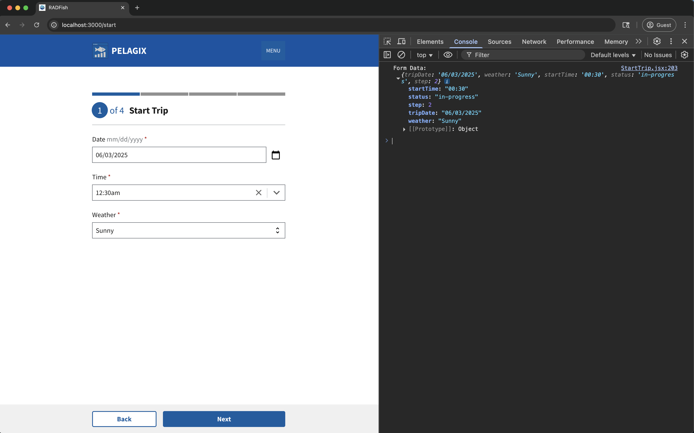

import CodeBlock from "@theme/CodeBlock";

# Lesson 2: Start Trip Form Inputs

This lesson focuses on building the first step of the trip logging form, the "Start Trip" page. We'll use components from the U.S. Web Design System (USWDS) library (`@trussworks/react-uswds`) to add inputs for the trip date, start time, and start weather.

## Step 1: Add Date Picker Input

We need a way for the user to select the date of their fishing trip. We'll use the `DatePicker` component from `@trussworks/react-uswds`.

### 1.1: Import the DatePicker Component

First, open `src/pages/StartTrip.jsx` and update the import statement from `@trussworks/react-uswds` to include `DatePicker`. Your existing import will be modified as follows:

```jsx title="src/pages/StartTrip.jsx" showLineNumbers=5
import {
  Button,
  //diff-add-start
  DatePicker,
  //diff-add-end
  Form,
  //diff-add-start
  FormGroup,
  //diff-add-end
  Grid,
  GridContainer,
  //diff-add-start
  Label,
  //diff-add-end
  StepIndicator,
  StepIndicatorStep,
} from "@trussworks/react-uswds";
```

**Understanding the USWDS Components:**

Before we start building the form, let's understand what each of these imported components does:

- **`Form`**: Main container for form elements with submission handling and styling
- **`FormGroup`**: Wrapper that groups form elements for proper spacing and accessibility
- **`Label`**: Creates accessible form labels with support for required indicators
- **`DatePicker`**: Calendar interface for date selection with formatting and validation

These components work together to create accessible, well-structured forms that follow USWDS design patterns and accessibility guidelines.

### 1.2: Add the DatePicker to the Form

**Add the `FormGroup`, `Label`, and `DatePicker` input within the `Form` component:**

```jsx title="src/pages/StartTrip.jsx" showLineNumbers=217
<Form onSubmit={handleSubmit} large>
  // diff-add-start
  <FormGroup>
    <Label
      htmlFor="tripDate"
      hint=" mm/dd/yyyy"
      className="input-date-label"
      requiredMarker
    >
      Date
    </Label>
    <DatePicker
      id="tripDate"
      name="tripDate"
      defaultValue={formData.tripDate}
      onChange={handleDateChange}
      aria-describedby="trip-date-hint"
      required
    />
    <span id="trip-date-hint" className="usa-sr-only">
      Please enter or select the date of your fishing trip.
    </span>
  </FormGroup>
  // diff-add-end
</Form>
```

#### React State Management Explanation

Let's look at two key aspects of how React manages state with this form:

1. **Initial State with `defaultValue`**:

   ```jsx title="src/pages/StartTrip.jsx" showLineNumbers=239
   defaultValue={formData.tripDate}
   ```

   - The component initializes form data using React's useState hook:

   ```jsx title="src/pages/StartTrip.jsx" showLineNumbers=56
   const [formData, setFormData] = useState({
     tripDate: "",
     startWeather: "",
     startTime: "",
   });
   ```

   - This binds the DatePicker's initial value to the component's state
   - When the form first renders, it displays any existing data if editing a trip, or empty if creating a new trip
   - To learn more about React state management, visit [React's Managing State documentation](https://react.dev/learn/managing-state)

2. **Updating State with `onChange`**:

   ```jsx title="src/pages/StartTrip.jsx" showLineNumbers=240
   onChange = { handleDateChange };
   ```

   - The `onChange` attribute is a required prop for controlled inputs. It is called whenever the input's value changes (on every keystroke or selection). Without this handler, React would revert the input to its original value after each change.
   - When a user selects a date, the `handleDateChange` function is called

   ```jsx title="src/pages/StartTrip.jsx" showLineNumbers=132
   const handleDateChange = (value) => {
     setFormData((prevData) => ({ ...prevData, tripDate: value || "" }));
   };
   ```

   - It preserves other form field values by spreading the previous state
   - To learn more about controlled inputs, visit [Input documentation](https://react.dev/reference/react-dom/components/input#controlling-an-input-with-a-state-variable)

## Step 2: Add Time Picker Input

Next, we'll add an input for the trip's start time using the `TimePicker` component.

### 2.1: Import the TimePicker Component

Update the import statement from `@trussworks/react-uswds` to include `TimePicker`. Your existing import will be modified as follows:

```jsx title="src/pages/StartTrip.jsx" showLineNumbers=5
import {
  Button,
  DatePicker,
  Form,
  FormGroup,
  Grid,
  GridContainer,
  Label,
  StepIndicator,
  StepIndicatorStep,
  //diff-add-start
  TimePicker,
  //diff-add-end
} from "@trussworks/react-uswds";
```

### 2.2: Add the TimePicker to the Form

Let's add the `TimePicker` input below the `DatePicker` form group:

```jsx title="src/pages/StartTrip.jsx" showLineNumbers=249
// diff-add-start
<FormGroup>
  <Label htmlFor="startTime" className="input-time-label" requiredMarker>
    Time
  </Label>
  <TimePicker
    id="startTime"
    name="startTime"
    defaultValue={formData.startTime}
    onChange={handleTimeChange}
    minTime="00:00"
    maxTime="23:45"
    step={15}
    aria-describedby="start-time-hint"
  />
  <span id="start-time-hint" className="usa-sr-only">
    Please enter or select the time you started fishing.
  </span>
</FormGroup>
// diff-add-end
```

**Explanation:**

- Similar to the `DatePicker`, we use `FormGroup` and `Label` for structure and accessibility
- `defaultValue={formData.startTime}` binds the input to the `startTime` field in our state
- `onChange={handleTimeChange}` calls our specific handler function to update the state
- `minTime`, `maxTime`, and `step={15}` configure the available time options (from 00:00 to 23:45 in 15-minute increments)

## Step 3: Add Weather Select Input

Finally, we need a dropdown menu for the user to select the weather conditions at the start of the trip. We'll use the `Select` component.

### 3.1: Import the Select Component

Update the import statement from `@trussworks/react-uswds` to include `Select`. Your existing import will be modified as follows:

```jsx title="src/pages/StartTrip.jsx" showLineNumbers=5
import {
  Button,
  DatePicker,
  Form,
  FormGroup,
  Grid,
  GridContainer,
  Label,
  //diff-add-start
  Select,
  //diff-add-end
  StepIndicator,
  StepIndicatorStep,
  TimePicker,
} from "@trussworks/react-uswds";
```

### 3.2: Add the Select to the Form

Add the following code below the `TimePicker` form group:

```jsx title="src/pages/StartTrip.jsx" showLineNumbers=272
// diff-add-start
<FormGroup>
  <Label htmlFor="startWeather" requiredMarker>
    Weather
  </Label>
  <Select
    id="startWeather"
    name="startWeather"
    value={formData.startWeather}
    onChange={handleInputChange}
    aria-describedby="start-weather-hint"
  >
    <option value="">-Select-</option>
    <option value="Sunny">Sunny</option>
    <option value="Cloudy">Cloudy</option>
    <option value="Rainy">Rainy</option>
  </Select>
  <span id="start-weather-hint" className="usa-sr-only">
    Please select the weather conditions at the start of your fishing trip.
  </span>
</FormGroup>
// diff-add-end
```

**Explanation:**

- `value={formData.startWeather}` binds the selected option to the `startWeather` field in the state.
- `onChange={handleInputChange}` uses the standard input handler (already present) because the `Select` component behaves like a standard HTML select element in this regard.
- We define the available weather options using standard HTML `<option>` tags within the `Select` component. The first option has an empty `value` to represent the default, unselected state.

The complete **Form** will look like this:

```jsx title="src/pages/StartTrip.jsx" showLineNumbers=228
// diff-add-start
<Form onSubmit={handleSubmit} large>
  <FormGroup>
    <Label
      htmlFor="tripDate"
      hint=" mm/dd/yyyy"
      className="input-date-label"
      requiredMarker
    >
      Date
    </Label>
    <DatePicker
      id="tripDate"
      name="tripDate"
      defaultValue={formData.tripDate}
      onChange={handleDateChange}
      aria-describedby="trip-date-hint"
      required
    />
    <span id="trip-date-hint" className="usa-sr-only">
      Please enter or select the date of your fishing trip.
    </span>
  </FormGroup>
  <FormGroup>
    <Label htmlFor="startTime" className="input-time-label" requiredMarker>
      Time
    </Label>
    <TimePicker
      id="startTime"
      name="startTime"
      defaultValue={formData.startTime}
      onChange={handleTimeChange}
      minTime="00:00"
      maxTime="23:45"
      step={15}
      aria-describedby="start-time-hint"
    />
    <span id="start-time-hint" className="usa-sr-only">
      Please enter or select the time you started fishing.
    </span>
  </FormGroup>
  <FormGroup>
    <Label htmlFor="startWeather" requiredMarker>
      Weather
    </Label>
    <Select
      id="startWeather"
      name="startWeather"
      value={formData.startWeather}
      onChange={handleInputChange}
      aria-describedby="start-weather-hint"
    >
      <option value="">-Select-</option>
      <option value="Sunny">Sunny</option>
      <option value="Cloudy">Cloudy</option>
      <option value="Rainy">Rainy</option>
    </Select>
    <span id="start-weather-hint" className="usa-sr-only">
      Please select the weather conditions at the start of your fishing trip.
    </span>
  </FormGroup>
</Form>
// diff-add-end
```

## Step 4: Testing Form Data Collection

Before we learn how to save data to storage in the next lesson, let's first see what our form data looks like when submitted. We'll modify the form submission to display the collected data in the browser console.

### 4.1: Update the form submission handler

Locate the `handleSubmit` function. Replace the existing submission logic with the following code that will log the form data to the console:

```jsx title="src/pages/StartTrip.jsx" showLineNumbers=183
if (Object.keys(newErrors).length === 0) {
  let navigateToId = currentTripId;
  //diff-add-start
  console.log("Form Data:", {
    tripDate: formData.tripDate,
    startWeather: formData.startWeather,
    startTime: formData.startTime,
    status: "in-progress",
    step: 2,
  });
  //diff-add-end
}
```

**Explanation:**

- We gather all the form data (`tripDate`, `startWeather`, `startTime`) into a single object
- We add metadata fields like `status: "in-progress"` and `step: 2` that will be useful for tracking form progress
- `console.log()` outputs this data structure to the browser's developer console so we can inspect it

### 4.2: Test the form submission

Now let's test our form to see the data structure:

1. Fill out all the form fields (Date, Start Time, Start Weather)
2. Click the "Next" button
3. Open your browser's developer console (F12 or right-click → Inspect → Console tab)
4. You should see the form data logged to the console



This shows you exactly what data structure we'll be saving to IndexedDB in the next lesson. You can see how React has collected all your form inputs into a clean, structured object.

## Conclusion

You have now successfully implemented the user interface for the first step of the trip logging form! You've added USWDS `DatePicker`, `TimePicker`, and `Select` components to capture the trip's start date, start time, and start weather. These inputs are connected to the component's state, ready to be saved. The development server is running with HMR, making it easy to see your changes as you make them.

In the next lesson, we will implement the logic to save the data entered in this form using RADFish's offline storage capabilities (IndexedDB) and navigate the user to the next step.
