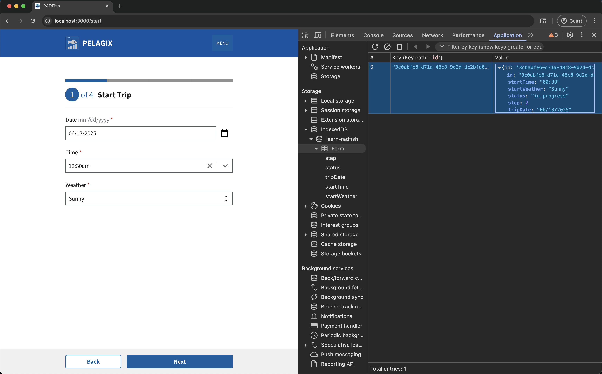
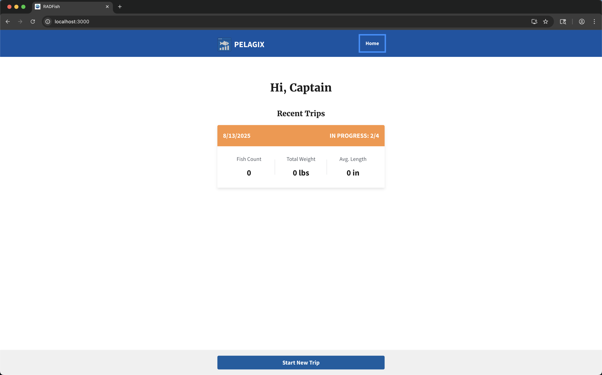

# Lesson 3: Form Submission

<details>
  <summary>🏳️ Haven't completed the previous lesson?</summary>

  No worries! You can pickup from here:

  ```bash
  git checkout tags/lesson-3
  ```
</details>

In this lesson, we'll enhance the "Start Trip" form to save the initial trip details (date, start time, start weather) to offline storage using IndexedDB via RADFish. We'll also navigate the user to the next step in the form process, the "Catch Log" page.

## Step 1: Understanding RADFish Storage

Before we save data, let's understand how RADFish organizes and structures data using schemas and collections.

### 1.1: The Form Schema

RADFish uses **schemas** to define the structure and validation rules for your data. Think of a schema as a blueprint that tells RADFish what fields your data should have, their types, and any constraints.

The `TripCollection` schema for our trip application is defined in `src/index.jsx` within the RADFish Application configuration. **You'll need to add the fields for the start trip data (`tripDate`, `startTime`, `startWeather`) to the schema as shown in the highlighted lines below:**

```jsx title="src/index.jsx"
stores: {
  TripStore: {
    connector: new IndexedDBConnector("learn-radfish"),
    collections: {
      TripCollection: {
        schema: {
          fields: {
            id: {
              type: "string",
              primaryKey: true,
            },
            step: {
              type: "number",
              required: true,
              default: 1
            },
            status: {
              type: "string",
              required: true,
              default: "none",
            },
            // diff-add-start
            tripDate: {
              type: "string",
              required: true,
            },
            startTime: {
              type: "string",
              required: true,
            },
            startWeather: {
              type: "string",
              required: true,
            },
            //diff-add-end
          },
        },
      },
    },
  },
},
```

**Understanding the Structure:**

- **`stores`**: The top-level container that holds all your application's data stores
- **`tripStore`**: Our specific store name - you can have multiple stores for different domains (e.g., "users", "settings", "inventory")
- **`connector: new IndexedDBConnector("learn-radfish")`**: Specifies that this store uses IndexedDB as the storage backend, with "learn-radfish" as the database name
- **`collections`**: Contains all the different types of data within this store. The "TripCollection" collection is used to store the trip form data.

**Key Schema Concepts:**

- **Fields**: Define the structure of your data - each field represents a piece of information we want to store
- **Types**: Specify what kind of data each field accepts (`string`, `number`, `timestamp`, etc.)
- **Primary Key**: The `id` field serves as a unique identifier for each trip record
- **Required**: Fields marked as `required: true` must have a value when creating records
- **Defaults**: Provide initial values for fields when records are created

This schema ensures data consistency and provides validation when we create or update trip records in IndexedDB. To read more about RADFish storage, visit the [RADFish Storage documentation](https://nmfs-radfish.github.io/radfish/design-system/storage).

### 1.2: Import and access the RADFish application

To access our RADFish stores and collections, we need to import the `useApplication` hook and React Router navigation tools.

First, add these imports at the top of the `StartTrip.jsx` file:

```jsx title="src/pages/StartTrip.jsx"
import "../index.css";
//diff-remove-start
import React, { useState } from "react";
import { useNavigate } from "react-router-dom";
//diff-remove-end
//diff-add-start
import React, { useState, useEffect } from "react";
import { useNavigate, useLocation } from "react-router-dom";
import { useApplication } from "@nmfs-radfish/react-radfish";
//diff-add-end
import {
  Button,
  DatePicker,
  Form,
  FormGroup,
  Label,
  Select,
  TimePicker,
} from "@trussworks/react-uswds";
import Layout from "../components/Layout";
//diff-add-start
import { STORE_NAMES, COLLECTION_NAMES } from "../utils";
//diff-add-end
```

Then, inside the `StartTrip` component, add the hooks and state:

```jsx title="src/pages/StartTrip.jsx"
function StartTrip() {
  const navigate = useNavigate();
  // --- Navigation ---
  // React Router navigation hook for programmatic routing
  //diff-remove-start
  const tripId = "";
  //diff-remove-end
  //diff-add-start
  const app = useApplication();
  const location = useLocation();
  const tripId = location.state?.tripId;
  //diff-add-end
  
  // State management - existing tripData state from lesson 2
  const [tripData, setTripData] = useState({
    tripDate: undefined,
    startWeather: undefined,
    startTime: undefined,
  });
```

**Explanation:**

- **`useEffect`**: This is a React hook that allows us to perform side effects in our component. In this case, we're using it to load existing trip data if we're editing an existing trip. Read more about [useEffect](https://react.dev/reference/react/useEffect) in the React documentation.
- **`useApplication()`**: This hook provides access to the RADFish application context, including all configured stores and collections
- **`app`**: The application object that contains our "trip" store and its collections
- **`useNavigate()`**: React Router hook for programmatic navigation between pages
- **`useLocation()`**: React Router hook that provides access to the current location object
- **`tripId`**: Extracted from the location state - this tells us if we're editing an existing trip or creating a new one

### 1.3: Load existing trip data

If we're editing an existing trip, we need to load its data and populate the form. Let's add this functionality using a `useEffect` hook.

Add this code after your state declarations:

```jsx title="src/pages/StartTrip.jsx"
// Loading state - used to show loading message while fetching trip data
const [isLoading, setIsLoading] = useState(false);

// Load existing trip data if editing
//diff-add-start
useEffect(() => {
  const loadExistingTrip = async () => {
    //diff-add-end
    // Only load if we have the app instance and a tripId
    //diff-add-start
    if (!app || !tripId) {
      setIsLoading(false);
      return;
    }

    setIsLoading(true);
    try {
      //diff-add-end
      // Direct access to RADFish stores and collections
      //diff-add-start
      const tripStore = app.stores[STORE_NAMES.TRIP_STORE];
      const tripCollection = tripStore.getCollection(COLLECTION_NAMES.TRIP_COLLECTION);
      //diff-add-end

      // Find trips matching this ID
      //diff-add-start
      const existingTripsData = await tripCollection.find({ id: tripId });

      if (existingTripsData.length > 0) {
        const tripData = existingTripsData[0];
        //diff-add-end

        // Format date for DatePicker compatibility (YYYY-MM-DD)
        //diff-add-start
        const formattedDate = tripData.tripDate ? 
          new Date(tripData.tripDate).toISOString().split('T')[0] : "";

        setTripData({
          tripDate: formattedDate,
          startWeather: tripData.startWeather || "",
          startTime: tripData.startTime || "",
        });
      } else {
        //diff-add-end
        // If trip not found, treat as new trip
        //diff-add-start
        console.warn(`Trip with ID ${tripId} not found. Starting new trip form.`);
        setTripData({ tripDate: "", startWeather: "", startTime: "" });
      }
    } catch (error) {
      console.error("Error loading trip data:", error);
    } finally {
      // Ensure loading indicator is turned off
      setIsLoading(false);
    }
  };

  loadExistingTrip();
}, [tripId, app]);
//diff-add-end
```

**Understanding the Complete Data Loading Pattern:**

- **Loading State Management**: We set `isLoading` to true when starting the async operation and ensure it's set to false in both success and error cases using the `finally` block. This prevents the UI from getting stuck in a loading state.
- **Early Return Pattern**: If we don't have the required `app` or `tripId`, we return early after setting `isLoading` to false. This prevents unnecessary async operations.
- **`app.stores[STORE_NAMES.TRIP_STORE]`**: Accesses the RADFish data store named "trip", which we configured in section 1.1. Stores group related data collections.
- **`tripStore.getCollection(COLLECTION_NAMES.TRIP_COLLECTION)`**: Within the `tripStore` store, accesses the collection named "TripCollection". Collections are analogous to tables in a relational database or collections in MongoDB; they hold the actual data records (in this case, our "TripCollection" data).
- **`tripCollection.find({ id: tripId })`**: Queries the collection for records matching the provided criteria. This returns an array of matching trips. We use `find()` instead of `findById()` as it's the standard RADFish collection method.
- **Date Formatting**: The DatePicker component expects dates in YYYY-MM-DD format. We use `toISOString().split('T')[0]` to convert the stored date into this format.
- **Error Handling**: If no trip is found with the given ID, we reset the form to empty values and log a warning. This handles cases where users might have an invalid or outdated trip ID.
:::info
**Constants for Store and Collection Names:**

The `../utils` file centralizes store and collection names (like `STORE_NAMES.TRIP_STORE` and `COLLECTION_NAMES.TRIP_COLLECTION`) to prevent typos and make future changes easier. We'll use `COLLECTION_NAMES.CATCH_COLLECTION` in lesson 4.
:::

### 1.4: Declare navigation functions

To better organize our code, we'll declare our navigation functions here:

```jsx title="src/pages/StartTrip.jsx"
/**
  * Navigates back to the home page
  */
const navigateHome = () => {
  navigate("/");
};

//diff-add-start
// Helper to pass tripId between pages in our multi-step form
const navigateWithTripId = (path, tripId) => {
  navigate(path, { state: { tripId } });
};
//diff-add-end
```

The `navigateWithTripId` helper ensures each page in our workflow knows which trip it's working with by passing the `tripId` through React Router's state.

## Step 2: Saving Trip Data

### 2.1: Prepare the trip data object

Before we can save or update the trip, we need to prepare the data object with all the form values plus some metadata.

In lesson 2, we used `console.log()` to test our form data collection. Now we'll replace that with actual data preparation for storage.

```jsx title="src/pages/StartTrip.jsx"
const handleSubmit = async (e) => {
  e.preventDefault();

  //diff-remove-start
  console.log("Trip Data:", {
    tripDate: tripData.tripDate,
    startWeather: tripData.startWeather,
    startTime: tripData.startTime,
    status: "in-progress",
    step: 2,
  });
   //diff-remove-end

  //diff-add-start
  try {
    const tripStore = app.stores[STORE_NAMES.TRIP_STORE];
    const tripCollection = tripStore.getCollection(COLLECTION_NAMES.TRIP_COLLECTION);

    const tripDataToSave = {
      tripDate: tripData.tripDate,
      startWeather: tripData.startWeather,
      startTime: tripData.startTime,
      status: "in-progress",
      step: 2,
    };

  } catch (error) {
    console.error("Error saving trip data:", error, "Trip ID:", tripId);
  }
  //diff-add-end
};

```

### 2.2: Update existing trip or create new trip

Now we handle both scenarios: updating an existing trip or creating a brand new one.

```jsx title="src/pages/StartTrip.jsx"
const handleSubmit = async (e) => {
  e.preventDefault();

  try {
    const tripStore = app.stores[STORE_NAMES.TRIP_STORE];
    const tripCollection = tripStore.getCollection(COLLECTION_NAMES.TRIP_COLLECTION);

    const tripDataToSave = {
      tripDate: tripData.tripDate,
      startWeather: tripData.startWeather,
      startTime: tripData.startTime,
      status: "in-progress",
      step: 2,
    };

    //diff-add-start
    let navigateToId = tripId;
    //diff-add-end

    //diff-add-start
    if (tripId) {
      await tripCollection.update({ id: tripId, ...tripDataToSave });
    } else {
      const newTripId = crypto.randomUUID();
      await tripCollection.create({
        id: newTripId,
        ...tripDataToSave,
      });
      navigateToId = newTripId;
    }
    //diff-add-end
  } catch (error) {
    console.error("Error saving trip data:", error, "Trip ID:", tripId);
  }
};
```

**Explanation:**

- **Update Path**: If `tripId` exists, we call `tripCollection.update()` with the existing ID and our `tripDataToSave`. RADFish finds the record in IndexedDB and updates it with the new values.
- **Create Path**: If no `tripId`, it's a new trip:
  - Generate a unique ID using `crypto.randomUUID()`
  - Call `tripCollection.create()` with the new ID and our `tripDataToSave`
  - Store the new ID for navigation

The `tripId` comes from React Router's location state, which is passed when navigating from other pages. This `tripId` is used to check if a trip has already been created - if it exists, we're editing an existing trip; if not, we're creating a new one. This approach gives us direct control over trip context and navigation.

Click the "Next" button to test the form submission. You should see the data being saved in IndexedDB.

:::tip Dev Tip: Inspecting IndexedDB

You can see the data being saved directly in your browser's developer tools:

1. Open your browser's developer tools (F12 or right-click → Inspect).
2. Go to the "Application" tab (Chrome/Edge) or "Storage" tab (Firefox).
3. In the left-hand panel, find "IndexedDB".
4. Expand the database `learn-radfish`.
6. Click on the "tripCollection" collection/index. You should see the trip data you just submitted.


:::

### 2.3: Navigate to the next step

After successfully saving the data, we'll demonstrate how the trip is now saved and accessible from the Home page.

Since we already have a test record in IndexedDB, we'll need to delete it to start fresh.

:::tip Dev Tip: Managing Test Data in IndexedDB

To delete a single record:

1. Open your browser's developer tools (F12 or right-click → Inspect).
2. Go to the "Application" tab (Chrome/Edge) or "Storage" tab (Firefox)
3. Navigate to IndexedDB → `learn-radfish` → `TripCollection`
4. Right-click on any test record you want to remove
5. Select "Delete" (Chrome/Edge) or click the delete button (Firefox)

To delete all records:

1. Navigate to IndexedDB → `learn-radfish`
2. Click on the "Delete database" button(chrome) or "Clear all data" button (firefox)

This helps keep your IndexedDB clean while testing and prevents confusion from multiple test records.
:::

Add the following navigation code after the create/update logic:

```jsx title="src/pages/StartTrip.jsx"
const handleSubmit = async (e) => {
  e.preventDefault();

  try {
    const tripStore = app.stores[STORE_NAMES.TRIP_STORE];
    const tripCollection = tripStore.getCollection(COLLECTION_NAMES.TRIP_COLLECTION);

    const tripDataToSave = = {
      tripDate: tripData.tripDate,
      startWeather: tripData.startWeather,
      startTime: tripData.startTime,
      status: "in-progress",
      step: 2,
    };

    let navigateToId = tripId;

    if (tripId) {
      await tripCollection.update({ id: tripId, ...tripData });
    } else {
      const newTripId = crypto.randomUUID();
      await tripCollection.create({
        id: newTripId,
        ...tripData,
      });
      navigateToId = newTripId;
    }
    //diff-add-start
    navigateWithTripId("/catch", navigateToId);
    //diff-add-end
  } catch (error) {
    console.error("Error saving trip data:", error, "Trip ID:", tripId);
  }
};
```

After implementing the navigation code, test the workflow:

1. **Click the "Next" button** - This saves your trip data to RADFish stores
2. **Navigate to the Home page** - Click the "Home" button in the navigation menu
3. **View your saved trip** - You should now see your trip listed on the homepage
4. **Resume your trip** - Clicking on the saved trip will take you back to where you left off in the form



**Understanding the Navigation Flow:**

- The `navigateWithTripId()` function we created in section 1.4 is used to continue to the `/catch` route when resuming a trip
- This function uses React Router's `navigate` function with state to pass the trip context
- The trip is now persistent in RADFish stores, allowing users to continue their work from the Home page at any time
- We pass the `tripId` (either existing or newly created) as the second parameter
- This ensures the Catch Log page receives the correct trip context and knows which trip it's associated with

## Conclusion

You have now successfully implemented the submission logic for the first step of the trip form! The application saves the initial trip details to IndexedDB using RADFish, handling both new trip creation and updates. Upon successful submission, the user is automatically navigated to the next step, ready to log their catches.

**What You've Learned:**

- **Direct RADFish Access**: You've learned to work directly with RADFish stores and collections using constants for better maintainability
- **Manual Data Loading**: You implemented useEffect to load existing trip data with direct collection queries
- **React Router State Management**: You used location state and navigate functions to handle trip context between pages
- **CRUD Operations**: You created and updated trip records using RADFish's create() and update() methods

**Looking Ahead:**

In the next lesson, we'll build the **Catch Log** functionality where users can dynamically add, edit, and delete multiple fish catches. You'll learn how to manage dynamic form inputs - adding new catch records on the fly, displaying them in a list, and handling updates and deletions. We'll also introduce custom hooks to simplify some of the data management patterns you've learned here.
