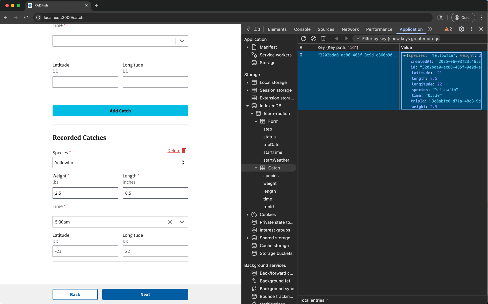

# Lesson 4: Dynamic Inputs

In this lesson, we will implement the functionality to add new catches to our trip log. When the user fills out the "Add Catch" form and clicks the button, we need to save this data to the offline database (IndexedDB) using RADFish and then update the user interface to display the newly added catch in the "Recorded Catches" list.

## Step 1: Setting Up the Catch Collection

Before we can save catch data, we need to extend our RADFish storage schema to include a new collection for individual catches.

### 1.1: Add the Catch Collection Schema

RADFish organizes different types of data into separate **collections**. While our "Form" collection stores trip-level information (trip date, start time, start weather), we need a separate "Catch" collection to store individual catch records.

Open `src/index.jsx` and locate the `collections` section within the trip store. **You'll need to add the Catch collection schema after the Form collection as shown in the highlighted lines below:**

```jsx title="src/index.jsx" showLineNumbers=66
        },
      },
      // diff-add-start
      Catch: {
        schema: {
          fields: {
            id: {
              type: "string",
              primaryKey: true,
            },
            species: {
              type: "string",
              required: true,
            },
            weight: {
              type: "number",
              required: true,
            },
            length: {
              type: "number",
              required: true,
            },
            latitude: {
              type: "number",
            },
            longitude: {
              type: "number",
            },
            time: {
              type: "string",
              required: true,
            },
            tripId: {
              type: "string",
              required: true,
            }
          },
        },
      },
      // diff-add-end
    },
  },
},
```

**Understanding the Catch Schema:**

- **`species`**: String field for the type of fish caught (required)
- **`weight`** and **`length`**: Number fields for physical measurements (required)
- **`latitude`** and **`longitude`**: Optional number fields for GPS coordinates
- **`time`**: String field for when the catch was recorded (required)
- **`tripId`**: Links each catch to its parent trip (required for data relationships)

This schema ensures each catch record has consistent structure and validation rules. The `tripId` field creates a relationship between catches and their associated trip.

### 1.2: Understanding Data Relationships

RADFish uses a **collection-based approach** where related data is stored in separate collections but linked through foreign keys:

- **Form Collection**: Stores trip-level data (one record per trip)
- **Catch Collection**: Stores individual catch data (multiple records per trip)
- **Relationship**: Each catch record contains a `tripId` field that references the trip's `id`

This approach provides several benefits:
- **Flexibility**: Add unlimited catches to any trip
- **Performance**: Query catches independently from trip data
- **Data Integrity**: Each collection has its own validation rules

## Step 2: Saving New Catch Data

Now we'll implement the logic to save new catch records when users submit the "Add Catch" form.

### 2.1: Access the Catch Collection

First, we need to access the RADFish Catch collection within our form submission handler.

Open `src/pages/CatchLog.jsx` and locate the `handleAddCatch` function. Find the comment `// Create record in RADFish/IndexedDB` and replace it with the following code:

```jsx title="src/pages/CatchLog.jsx" showLineNumbers=265
// diff-add-start
await Catch.create(newCatchData);
// diff-add-end
```

**Explanation:**

- `Catch.create(newCatchData)`: Calls the `create` method on the RADFish Catch collection
- The `newCatchData` object contains all form values plus generated metadata (ID, tripId, timestamp)
- RADFish validates the data against our schema and saves it to IndexedDB
- The operation is asynchronous, so we use `await` to ensure completion before proceeding

### 2.2: Update Component State for UI Rendering

After successfully saving to IndexedDB, we need to update React's component state so the UI immediately reflects the new catch.

In the same `handleAddCatch` function, below the `await Catch.create(newCatchData)`, add the following code:

```jsx title="src/pages/CatchLog.jsx" showLineNumbers=269
// diff-add-start
setCatches(prev => [newCatchData, ...prev]);
// diff-add-end
```

**React State Management Explanation:**

This code demonstrates a key React pattern for updating arrays in state:

1. **Immutable Updates**: Instead of modifying the existing `catches` array, we create a new array
2. **Function-Based State Update**: `setCatches(prev => ...)` receives the current state and returns the new state
3. **Spread Operator**: `[newCatchData, ...prev]` creates a new array with:
   - `newCatchData` at the beginning (newest first)
   - All previous catches spread after it (`...prev`)

This triggers React's re-rendering process, immediately updating the "Recorded Catches" list without requiring a page refresh.

### 2.3: Form Reset and User Experience

The complete `handleAddCatch` function also handles form cleanup after successful submission. Here's how the full process works:

```jsx title="src/pages/CatchLog.jsx" showLineNumbers=272
setCurrentCatch({ species: "", weight: "", length: "", latitude: "", longitude: "", time: "" });
setCatchTimeKey(prevKey => prevKey + 1); // Reset TimePicker
setSubmitted(false); // Reset submission status
```

**Understanding the Reset Process:**

- **`setCurrentCatch(...)`**: Clears all form input values back to empty strings
- **`setCatchTimeKey(prevKey => prevKey + 1)`**: Forces the TimePicker component to re-render with a new React key
- **`setSubmitted(false)`**: Resets form submission state for validation display

This provides immediate feedback to users and prepares the form for entering additional catches.

## Step 3: Testing the Implementation

Let's test the catch logging functionality to see the complete flow in action.

### 3.1: Fill Out the Add Catch Form

1. Navigate to the Catch Log page (you should be there after completing lesson 3)
2. Fill out all required fields in the "Add Catch" form:
   - **Species**: Select from the dropdown (e.g., "Yellowfin")
   - **Weight**: Enter a number (e.g., "25.5")
   - **Length**: Enter a number (e.g., "32")
   - **Time**: Select a time (e.g., "10:30")
   - **Latitude/Longitude**: Optional coordinate fields

### 3.2: Submit and Observe the Results

Click the "Add Catch" button and observe:

1. **Form Reset**: The form fields clear automatically
2. **List Update**: A new entry appears in the "Recorded Catches" section
3. **Data Persistence**: The catch is saved to IndexedDB (inspect using browser dev tools)

:::tip Dev Tip: Inspecting Catch Data

You can verify catch data is being saved by inspecting IndexedDB:

1. Open your browser's developer tools (F12 or right-click → Inspect).
2. Go to the "Application" tab (Chrome/Edge) or "Storage" tab (Firefox).
3. Navigate to IndexedDB → learn-radfish → trip → Catch
4. You should see your catch records with all the form data


:::

## Conclusion

You have successfully implemented dynamic catch logging functionality! The application now:

1. **Extends RADFish storage** with a new Catch collection for individual catch records
2. **Saves catch data** persistently to IndexedDB using RADFish's collection methods
3. **Updates the UI immediately** using React state management patterns
4. **Provides smooth user experience** with automatic form reset and list updates

Users can now log multiple catches during their trip, with each catch stored independently but linked to the parent trip. The data persists offline and will be available even if the user closes and reopens the application.

In the next lesson, we'll add validation to ensure users enter valid data before catches are saved to the database.
