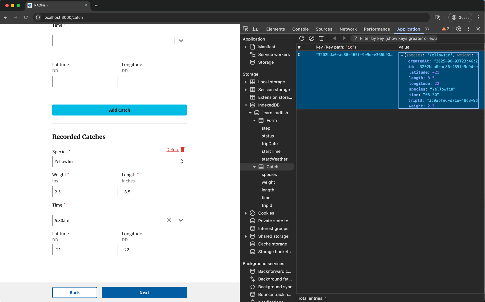

# Lesson 4: Dynamic Inputs

In this lesson, we will implement the functionality to add new catches to our trip log. When the user fills out the "Add Catch" form and clicks the button, we need to save this data to the offline database (IndexedDB) using RADFish and then update the user interface to display the newly added catch in the "Recorded Catches" list.

## Step 1: Setting Up the Catch Collection

Before we can save catch data, we need to extend our RADFish storage schema to include a new collection for individual catches.

### 1.1: Add the Catch Collection Schema

RADFish organizes different types of data into separate **collections**. While our "Form" collection stores trip-level information (trip date, start time, start weather), we need a separate "Catch" collection to store individual catch records.

Open `src/index.jsx` and locate the `collections` section within the trip store. **You'll need to add the Catch collection schema after the Form collection as shown in the highlighted lines below:**

```jsx title="src/index.jsx"
  collections: {
    Form: {
      schema: {
        fields: {
          id: {
            type: "string",
            primaryKey: true,
          },
          step: {
            type: "number",
            required: true,
            default: 1
          },
          status: {
            type: "string",
            required: true,
            default: "none",
          },
          tripDate: {
            type: "string",
            required: true,
          },
          startTime: {
            type: "string",
            required: true,
          },
          startWeather: {
            type: "string",
            required: true,
          },
        },
      },
    },
    //diff-add-start
    Catch: {
      schema: {
        fields: {
          id: {
            type: "string",
            primaryKey: true,
          },
          species: {
            type: "string",
            required: true,
          },
          weight: {
            type: "number",
            required: true,
          },
          length: {
            type: "number",
            required: true,
          },
          latitude: {
            type: "number",
          },
          longitude: {
            type: "number",
          },
          time: {
            type: "string",
            required: true,
          },
          tripId: {
            type: "string",
            required: true,
          }
        },
      },
    },
    //diff-add-end
  },
```

**Understanding the Catch Schema:**

- **`species`**: String field for the type of fish caught (required)
- **`weight`** and **`length`**: Number fields for physical measurements (required)
- **`latitude`** and **`longitude`**: Optional number fields for GPS coordinates
- **`time`**: String field for when the catch was recorded (required)
- **`tripId`**: Links each catch to its parent trip (required for data relationships)

This schema ensures each catch record has consistent structure and validation rules. The `tripId` field creates a relationship between catches and their associated trip.

### 1.2: Understanding Data Relationships

RADFish uses a **collection-based approach** where related data is stored in separate collections but linked through foreign keys:

- **Form Collection**: Stores trip-level data (one record per trip)
- **Catch Collection**: Stores individual catch data (multiple records per trip)
- **Relationship**: Each catch record contains a `tripId` field that references the trip's `id`

This approach provides several benefits:

- **Flexibility**: Add unlimited catches to any trip
- **Performance**: Query catches independently from trip data
- **Data Integrity**: Each collection has its own validation rules

## Step 2: Component Setup with Custom Hooks

Now we'll set up the CatchLog component using the custom hooks. The necessary imports have already been provided for you in the CatchLog.jsx file.

### 2.1: Understanding the Provided Imports

Open `src/pages/CatchLog.jsx` and you'll see these imports are already included:

```jsx title="src/pages/CatchLog.jsx"
import React, { useState } from "react";
import { useApplication } from "@nmfs-radfish/react-radfish";
import {
  Button,
  ErrorMessage,
  Form,
  FormGroup,
  Icon,
  Label,
  Select,
  TextInput,
  TimePicker,
} from "@trussworks/react-uswds";
import {
  FIELD_NAMES,
  SPECIES_OPTIONS,
  TIME_PICKER_CONFIG,
  STORE_NAMES,
  COLLECTION_NAMES,
} from "../utils";
import { useTripNavigation, useTripData, useCatchData } from "../hooks";
import { Layout } from "../components/Layout";
```

**Understanding the Provided Imports:**

- **Utility Constants**: Predefined values for species options, time picker configuration, and store/collection names
- **Custom Hooks**: `useCatchData` manages catch-specific operations, building on the patterns from lesson 3
- **Layout Component**: Provides the grid structure and step indicator (passed `currentStep={2}` for the Catch Log page)

:::info
The complete UI structure is already provided in the file. You'll focus on implementing the core event handlers that make the form functional.
:::

### 2.2: Understanding the Component Setup

The component setup with custom hooks is already provided. Let's understand how these hooks are initialized:

```jsx title="src/pages/CatchLog.jsx"
function CatchLog() {
  // --- RADFish Application Context ---
  const app = useApplication();

  // --- Custom Hooks ---
  // Navigation hook for trip-specific routing
  const { tripId, navigateHome, navigateWithTripId } = useTripNavigation();

  // Trip data hook - only used for verification and step updates
  const { updateTrip } = useTripData(
    tripId,
    (error) => {
      console.warn("Trip loading error:", error);
      navigateHome();
    },
    { loadOnMount: false } // Don't load trip data, just verify existence
  );

  // Use custom hook for catch data management
  const {
    catches,
    isLoading,
    addCatch,
    setCatches
  } = useCatchData(tripId, (error) => {
    console.warn("Catch data error:", error);
    if (error.message === "Trip not found" || error.message === "No trip ID provided") {
      navigateHome();
    }
  });
```

**Understanding the Hook Setup:**

- **`useTripNavigation()`**: Provides `tripId` and navigation functions (familiar from lesson 3)
- **`useTripData()`**: Used here only for updating trip step, not loading data (`loadOnMount: false`)
- **`useCatchData()`**: New hook that manages all catch-related operations including:
  - `catches`: Array of catch records for this trip
  - `isLoading`: Loading state for async operations
  - `addCatch`: Function to add new catches
  - `setCatches`: Direct state setter for optimistic updates

### 2.3: Component State Management

The local state for form management is also already set up in your file:

```jsx title="src/pages/CatchLog.jsx"
// --- State Management ---
// Form management state
const [catchTimeKey, setCatchTimeKey] = useState(0); // Forces TimePicker re-render on reset

// New catch form state
const [currentCatch, setCurrentCatch] = useState({
  species: "",
  weight: "",
  length: "",
  latitude: "",
  longitude: "",
  time: "",
});
const [errors, setErrors] = useState({}); // Validation errors for new catch form
```

**Understanding State Management:**

- **`catchTimeKey`**: Used to force TimePicker component re-rendering when resetting the form
- **`currentCatch`**: Stores the form data for the new catch being entered
- **`errors`**: Stores validation errors for the new catch form (infrastructure for lesson 5)

:::tip State Organization
Notice how we separate concerns: the `useCatchData` hook manages the persistent catch data, while local state handles temporary UI concerns like form inputs and error display.
:::

## Step 3: Implementing Form Event Handlers

Now we'll implement the event handlers for managing form inputs and submissions. This involves two steps: implementing the handlers and connecting them to the form elements.

:::tip What You'll Implement
You'll implement 5 main event handlers:
1. `handleInputChange` - For text and select inputs
2. `handleTimeChange` - For the TimePicker component
3. `resetForm` - To clear the form
4. `handleAddCatch` - For adding new catches
5. `handleSubmit` - For proceeding to the next step

The advanced handlers for editing recorded catches are already provided for you.
:::

### 3.1: Connecting Handlers to Form Elements

Before implementing the handlers, you need to understand that the form elements currently use placeholder handlers. After implementing your event handlers, you'll need to replace these placeholders:

```jsx title="src/pages/CatchLog.jsx"
// Current placeholder handlers that need to be replaced:
<Form onSubmit={() => {}}>  {/* Replace with: onSubmit={handleAddCatch} */}
  <Select onChange={() => {}}>  {/* Replace with: onChange={handleInputChange} */}
  <TextInput onChange={() => {}}>  {/* Replace with: onChange={handleInputChange} */}
  <TimePicker onChange={() => {}}>  {/* Replace with: onChange={handleTimeChange} */}
</Form>
```

### 3.2: Input Change Handlers

Now let's implement the handlers for managing form input changes. Replace the TODO comments with the actual implementations:

```jsx title="src/pages/CatchLog.jsx"
// --- Event Handlers for New Catch Form ---
/**
 * Handles input changes for new catch form
 * @param {Event} e - Input change event
 */
//diff-add-start
const handleInputChange = (e) => {
  const { name, value } = e.target;
  setCurrentCatch((prev) => ({ ...prev, [name]: value }));
  // Clear error for this field when user starts typing
  if (errors[name]) {
    setErrors((prev) => ({ ...prev, [name]: undefined }));
  }
};
//diff-add-end

/**
 * Handles time picker changes for new catch form
 * @param {string} time - Selected time value
 */
//diff-add-start
const handleTimeChange = (time, fieldName = "time") => {
  setCurrentCatch((prev) => ({ ...prev, [fieldName]: time }));
  // Clear error for this field when user selects time
  if (errors[fieldName]) {
    setErrors((prev) => ({ ...prev, [fieldName]: undefined }));
  }
};
//diff-add-end

/**
 * Resets the new catch form to initial state
 */
//diff-add-start
const resetForm = () => {
  setCurrentCatch({
    species: "",
    weight: "",
    length: "",
    latitude: "",
    longitude: "",
    time: "",
  });
  setErrors({});
};
//diff-add-end
```

**Understanding the Handlers:**

- **`handleInputChange`**: Manages text and select inputs, clears field-specific errors on change
- **`handleTimeChange`**: Specific handler for the TimePicker component
- **`resetForm`**: Utility function to clear the form after successful submission

### 3.3: Form Submission Handlers

Now let's implement the submission handlers for both adding new catches and proceeding to the next step:

```jsx title="src/pages/CatchLog.jsx"
/**
 * Handles new catch form submission
 * TODO: Add validation in the next lesson
 * @param {Event} e - Form submit event
 */
//diff-add-start
const handleAddCatch = async (e) => {
  e.preventDefault();
  try {
    const success = await addCatch(currentCatch);

    if (success) {
      // Reset form and increment key to force TimePicker re-render
      resetForm();
      setCatchTimeKey((prevKey) => prevKey + 1);
    } else {
      throw new Error("Failed to add catch");
    }
  } catch (error) {
    console.error("Error adding catch:", error);
  }
};
//diff-add-end

/**
 * Handles main form submission to proceed to next step
 * TODO: Add validation for recorded catches in the next lesson
 * @param {Event} e - Form submit event
 */
//diff-add-start
const handleSubmit = async (e) => {
  e.preventDefault();
  try {
    // Update trip step
    const success = await updateTrip({ step: 3 });
    if (success) {
      navigateWithTripId("/end", tripId);
    } else {
      throw new Error("Failed to update trip step");
    }
  } catch (error) {
    console.error("Error updating trip step:", error, "Trip ID:", tripId);
  }
};
//diff-add-end
```

**Key Implementation Details:**

- **`handleAddCatch`**: Uses the `addCatch` function from our custom hook, includes form reset logic
- **`handleSubmit`**: Updates the trip step and navigates to the next page using `updateTrip` from `useTripData`
- **Validation placeholders**: Comments show where validation will be added in lesson 5

### 3.4: Connecting Your Handlers

After implementing all 5 event handlers, you need to connect them to the form elements. Replace the placeholder handlers throughout the form:

```jsx title="src/pages/CatchLog.jsx"
// Replace Form onSubmit
//diff-remove-start
<Form onSubmit={() => {}} large className="margin-top-3 width-full">
//diff-remove-end
//diff-add-start
<Form onSubmit={handleAddCatch} large className="margin-top-3 width-full">
//diff-add-end

// Replace all input onChange handlers  
//diff-remove-start
<Select onChange={() => {}}>
<TextInput onChange={() => {}}>
//diff-remove-end
//diff-add-start
<Select onChange={handleInputChange}>
<TextInput onChange={handleInputChange}>
//diff-add-end

// Replace TimePicker onChange
//diff-remove-start
<TimePicker onChange={() => {}}>
//diff-remove-end
//diff-add-start
<TimePicker onChange={handleTimeChange}>
//diff-add-end

// Replace footer button onClick
//diff-remove-start
<Button onClick={() => {}}>
//diff-remove-end
//diff-add-start
<Button onClick={handleSubmit}>
//diff-add-end
```

:::tip Important Step
Don't forget this step! Your event handlers won't work until you connect them to the form elements by replacing all the `onChange={() => {}}` placeholders.
:::

## Step 4: Understanding the Form Structure and UI Components

In this step, we'll explore the form structures that are already provided in the initial code. Since you've already learned how to build forms in lessons 2, we're providing the complete form structure so you can focus on understanding how the components work together for catch logging.

### 4.1: New Catch Entry Form Structure

Let's examine the complete form structure for adding new catches that's already provided:

```jsx title="src/pages/CatchLog.jsx"
  return (
    <Layout currentStep={2}>
      {/* New Catch Entry Form Section */}
      <div className="width-full margin-y-0 margin-x-auto display-flex flex-column flex-align-start">
        <Form
          onSubmit={handleAddCatch}
          large
          className="margin-top-3 width-full"
        >
                  {/* Species Dropdown */}
                  <FormGroup>
                    <Label htmlFor="species" requiredMarker>
                      Species
                    </Label>
                    <Select
                      id="species"
                      name="species"
                      value={currentCatch.species}
                      onChange={() => {}}
                    >
                      <option value="">-Select-</option>
                      {SPECIES_OPTIONS.map((species) => (
                        <option key={species} value={species}>
                          {species}
                        </option>
                      ))}
                    </Select>
                  </FormGroup>
```

**Key Features of the Provided Form:**

- **Layout Component**: Wraps the form content and handles the grid/step indicator display
- **Species Dropdown**: Uses `SPECIES_OPTIONS` constant for consistent data
- **Form Structure**: Follows USWDS patterns established in previous lessons
- **Error Integration**: Each field is prepared for validation feedback
- **Accessibility**: Proper labels, hints, and ARIA attributes throughout

### 4.2: Weight, Length, and Time Input Structure

The provided form includes measurement and timing fields with the following structure:

```jsx title="src/pages/CatchLog.jsx"
{
  /* Weight & Length Inputs Row */
}
<div className="display-flex gap-2 width-full">
  {/* Weight Input*/}
  <div className="flex-1">
    <FormGroup error={errors.weight}>
      <Label htmlFor="weight" error={errors.weight} requiredMarker>
        Weight
      </Label>
      <span className="usa-hint display-block text-left">lbs</span>
      <TextInput
        id="weight"
        name="weight"
        type="number"
        value={currentCatch.weight}
        onChange={() => {}}
        validationStatus={errors.weight ? "error" : undefined}
        aria-describedby="weight-error-message"
      />
      <ErrorMessage id="weight-error-message" className="font-sans-2xs">
        {errors.weight}
      </ErrorMessage>
    </FormGroup>
  </div>
  {/* Length Input */}
  <div className="flex-1">
    <FormGroup error={errors.length}>
      <Label htmlFor="length" error={errors.length} requiredMarker>
        Length
      </Label>
      <span className="usa-hint display-block text-left">inches</span>
      <TextInput
        id="length"
        name="length"
        type="number"
        value={currentCatch.length}
        onChange={() => {}}
        validationStatus={errors.length ? "error" : undefined}
        aria-describedby="length-error-message"
      />
      <ErrorMessage id="length-error-message" className="font-sans-2xs">
        {errors.length}
      </ErrorMessage>
    </FormGroup>
  </div>
</div>;

{
  /* Catch Time Input */
}
<FormGroup error={errors.time}>
  <Label
    htmlFor="catchTime"
    error={errors.time}
    className="input-time-label"
    requiredMarker
  >
    Time
  </Label>
  <TimePicker
    key={catchTimeKey} // Use key to force re-render on reset
    id="catchTime"
    name="time"
    defaultValue={currentCatch.time}
    onChange={() => {}} 
    minTime={TIME_PICKER_CONFIG.MIN_TIME}
    maxTime="23:30"
    step={TIME_PICKER_CONFIG.STEP}
    validationStatus={errors.time ? "error" : undefined}
    className={errors.time ? "usa-input--error" : ""}
    aria-describedby="time-error-message"
  />
  <ErrorMessage id="time-error-message" className="font-sans-2xs">
    {errors.time}
  </ErrorMessage>
</FormGroup>;
```

**Important Features of the Provided Implementation:**

- **Error Integration**: Each field includes `ErrorMessage` components for validation feedback(will be explained in lesson 5)
- **Responsive Layout**: Weight and length use flexbox for side-by-side layout on mobile devices
- **TimePicker Key Strategy**: Uses `catchTimeKey` to force re-render on form reset (a common React pattern for controlled components)
- **Validation Infrastructure**: All fields include `validationStatus` props(will be explained in lesson 5)
- **Coordinate Fields**: Optional latitude/longitude inputs for GPS data collection

:::info About the Add Catch Button
The form includes a full-width "Add Catch" button that triggers the `handleAddCatch` function we implemented in Step 3. This creates new catch records and updates the UI immediately.
:::

## Step 5: Understanding the Recorded Catches Display

The initial code also provides a comprehensive section for displaying and managing recorded catches. Let's examine how this works and the features it provides.

### 5.1: Recorded Catches List Architecture

The recorded catches section uses the following structure:

```jsx title="src/pages/CatchLog.jsx"
{/* Recorded Catches Section */}
{catches.length > 0 && (
  <>
    {/* Container for the recorded catches section */}
    <div className="width-full border-top border-base-lighter padding-top-105 margin-top-105">
      <h2 className="font-heading-lg margin-bottom-1">
        Recorded Catches
      </h2>
      {/* List container for individual catch items */}
      <div className="display-flex flex-column width-full">
        {catches.map((catchItem, index) => {
          // Get errors for this specific catch item, default to empty object if none
          const catchErrors = recordedCatchErrors[index] || {};

          return (
            // Container for a single recorded catch item
            <div
              key={catchItem.id || index}
              className="padding-y-1 border-bottom border-base-lighter"
            >
              {/* Wrapper for the recorded catch form elements */}
              <div className="position-relative width-full">
                {/* Delete button positioned absolutely */}
                <div className="position-absolute top-neg-105 right-0">
                  <Button
                    type="button"
                    unstyled // Use unstyled to allow custom styling with utilities
                    onClick={() => handleDeleteCatch(index)}
                    className="text-secondary hover:bg-base-lightest border-radius-sm padding-05 display-flex flex-align-center"
                    aria-label="Delete this catch"
                  >
                    Delete{" "}
                    <Icon.Delete size={3} aria-hidden="true" />
                  </Button>
                </div>

                {/* Recorded Catch Form Fields */}
                <FormGroup error={catchErrors.species}>
                  <Label
                    htmlFor={`recorded-species-${index}`}
                    error={catchErrors.species}
                    requiredMarker
                  >
                    Species
                  </Label>
                  <Select
                    id={`recorded-species-${index}`}
                    name="species"
                    value={catchItem.species}
                    className="margin-top-05 margin-bottom-0"
                    onChange={(e) =>
                      handleRecordedCatchChange(
                        index,
                        "species",
                        e.target.value,
                      )
                    }
                    validationStatus={
                      catchErrors.species ? "error" : undefined
                    }
                  >
                    <option value="">-Select-</option>
                    {SPECIES_OPTIONS.map((species) => (
                      <option key={species} value={species}>
                        {species}
                      </option>
                    ))}
                  </Select>
                  <ErrorMessage className="font-sans-2xs">
                    {catchErrors.species}
                  </ErrorMessage>
                </FormGroup>
```

**Key Features of the Provided Implementation:**

- **Conditional Rendering**: Only shows when catches exist (`{catches.length > 0 && (...)}` pattern)
- **Dynamic Field IDs**: Each field gets a unique ID using the index (e.g., `recorded-species-${index}`)
- **Delete Functionality**: Positioned delete button with confirmation dialog
- **Error Integration**: Same error pattern as new catch form, but uses `recordedCatchErrors[index]`
- **Inline Editing**: Users can modify catches directly in the list without separate edit modes

### 5.2: Understanding the Provided Event Handlers for Recorded Catches

The event handlers for managing recorded catches are already provided in your file. These advanced functions demonstrate RADFish patterns including direct database access and optimistic UI updates.

#### 5.2.1: The Update Catch Function

Let's examine the provided `updateCatch` function that handles updating individual catch records:

```jsx title="src/pages/CatchLog.jsx"
  // --- Event Handlers for Recorded Catches ---
  /**
   * Update a specific catch
   * @param {number} index - Index of the catch in the catches array
   * @param {string} field - Field to update
   * @param {any} value - New value for the field
   * @returns {boolean} Success status
   */
  const updateCatch = async (index, field, value) => {
    if (!app || index < 0 || index >= catches.length) {
      console.error("Cannot update catch: invalid parameters");
      return false;
    }
    
    const catchToUpdate = catches[index];
    
    try {
      const tripStore = app.stores[STORE_NAMES.TRIP];
      const Catch = tripStore.getCollection(COLLECTION_NAMES.CATCH);

      // Prepare data for update (ensure correct types)
      const updateData = { [field]: value };

      // Convert to number if it's a numeric field, handle empty string
      if (["weight", "length", "latitude", "longitude"].includes(field)) {
        updateData[field] = value === "" ? undefined : Number(value);
      }
      
      // Update in RADFish/IndexedDB
      await Catch.update({ id: catchToUpdate.id, ...updateData });

      // Optimistic UI update
      const updatedCatches = [...catches];
      updatedCatches[index] = { ...catchToUpdate, [field]: updateData[field] };
      setCatches(updatedCatches);
      return true;
    } catch (err) {
      console.error("Error updating catch:", err, "Catch ID:", catchToUpdate.id);
      return false;
    }
  };
```

**Key Implementation Details:**

- **Parameter Validation**: Checks for valid app, index bounds, and catch existence
- **Direct Collection Access**: Uses `getCollection(COLLECTION_NAMES.CATCH)` for immediate database operations
- **Type Conversion**: Converts numeric fields appropriately, handling empty strings as `undefined`
- **Optimistic Updates**: Updates the UI immediately while the database operation completes

#### 5.2.2: The Change Handlers

The wrapper functions that connect form inputs to the update function are also provided:

```jsx title="src/pages/CatchLog.jsx"
  /**
   * Handles changes to recorded catch fields
   * @param {number} index - Index of the catch in the catches array
   * @param {string} field - Field name to update
   * @param {any} value - New value for the field
   */
  const handleRecordedCatchChange = async (index, field, value) => {
    const success = await updateCatch(index, field, value);
    
    if (!success) {
      console.error("Failed to update recorded catch");
    }
  };
  
  /**
   * Handles time changes for recorded catches
   * @param {number} index - Index of the catch in the catches array
   * @param {string} time - New time value
   */
  const handleRecordedTimeChange = async (index, time) => {
    const success = await updateCatch(index, "time", time);
    
    if (!success) {
      console.error("Failed to update recorded catch time");
    }
  };
```

**Understanding the Pattern:**

- **Wrapper Functions**: These provide a clean interface between UI events and database operations
- **Error Handling**: Logs failures but doesn't interrupt the user experience
- **Specific Time Handler**: TimePicker components need a dedicated handler due to their different event signature

#### 5.2.3: The Delete Functionality

The delete functionality is also provided with proper separation of concerns, including both a utility function and a wrapper handler:

```jsx title="src/pages/CatchLog.jsx"
  /**
   * Delete a catch
   * @param {number} index - Index of the catch to delete
   * @param {boolean} skipConfirmation - Skip confirmation dialog (default: false)
   * @returns {boolean} Success status
   */
  const deleteCatch = async (index, skipConfirmation = false) => {
    if (index < 0 || index >= catches.length) {
      console.error("Cannot delete catch: invalid index");
      return false;
    }
    
    if (!skipConfirmation && !window.confirm("Are you sure you want to delete this catch?")) {
      return false;
    }
    
    const catchToDelete = catches[index];
    
    try {
      const tripStore = app.stores[STORE_NAMES.TRIP];
      const Catch = tripStore.getCollection(COLLECTION_NAMES.CATCH);

      // Remove from RADFish/IndexedDB
      await Catch.delete({id: catchToDelete.id});
      
      // Update local state to remove from UI
      setCatches(prev => prev.filter((_, i) => i !== index));
      
      return true;
    } catch (err) {
      console.error("Error deleting catch:", err, "Catch ID:", catchToDelete.id);
      return false;
    }
  };
  
  /**
   * Handles deletion of a recorded catch
   * @param {number} index - Index of the catch to delete
   */
  const handleDeleteCatch = async (index) => {
    const success = await deleteCatch(index);
    
    if (!success) {
      console.error("Failed to delete catch");
    }
  };
```

**Key Implementation Patterns:**

- **Separation of Concerns**: `deleteCatch` utility function handles the core logic, `handleDeleteCatch` provides the UI interface
- **Optional Confirmation**: `skipConfirmation` parameter allows bypassing the dialog for programmatic deletions
- **Index Validation**: Ensures the catch exists before attempting deletion
- **Confirmation Dialog**: Uses `window.confirm()` to prevent accidental deletions
- **Optimistic UI**: Removes the catch from the UI immediately upon successful database deletion
- **Filter Pattern**: Uses `filter((_, i) => i !== index)` to remove the item at the specific index

:::info Why These Handlers Are Provided
The recorded catch handlers involve advanced patterns like direct database access and optimistic UI updates. By providing these, you can focus on learning the core concepts of dynamic form inputs and event handling without getting overwhelmed by the complexity of managing existing records.
:::

**Key Patterns in the Provided Handlers:**

- **Direct Database Access**: The handlers access RADFish collections directly for immediate updates
- **Optimistic Updates**: UI updates immediately while database operations happen in background
- **Type Conversion**: Handles converting numeric fields appropriately (weight, length, coordinates)
- **Error Handling**: Comprehensive error logging and graceful failure handling
- **Confirmation Dialogs**: Delete operations include user confirmation for safety
- **Index-Based Operations**: Uses array indices to track which catch is being modified

## Step 6: Testing the Complete Implementation

After implementing the 5 event handlers (handleInputChange, handleTimeChange, resetForm, handleSubmit, and handleMainSubmit), let's test both adding new catches and managing recorded catches.

### 6.1: Test Adding New Catches

1. Navigate to the Catch Log page (you should be there after completing lesson 3)
2. Fill out all required fields in the "Add Catch" form:
   - **Species**: Select from the dropdown (e.g., "Yellowfin Tuna")
   - **Weight**: Enter a number (e.g., "25.5")
   - **Length**: Enter a number (e.g., "32")
   - **Time**: Select a time (e.g., "10:30")
   - **Latitude/Longitude**: Optional coordinate fields
3. Click "Add Catch" and observe:
   - Form resets automatically
   - New catch appears in "Recorded Catches" section
   - TimePicker properly resets due to key strategy

### 6.2: Test Editing and Deleting Catches

1. **Edit a catch**: Change values in any recorded catch field and observe immediate updates
2. **Delete a catch**: Click the delete button and confirm the deletion
3. **Verify persistence**: Refresh the page to confirm data persists in IndexedDB

:::tip Dev Tip: Inspecting Catch Data

You can verify catch data is being saved by inspecting IndexedDB:

1. Open your browser's developer tools (F12 or right-click → Inspect).
2. Go to the "Application" tab (Chrome/Edge) or "Storage" tab (Firefox).
3. Navigate to IndexedDB → learn-radfish → trip → Catch
4. You should see your catch records with all the form data


:::

## Conclusion

You have successfully implemented comprehensive catch logging functionality! The application now:

1. **Uses Custom Hooks**: Leverages `useCatchData` for catch management, building on lesson 3's hook patterns
2. **Extends RADFish Storage**: Adds a Catch collection with proper schema and relationships
3. **Provides Full CRUD Operations**: Create, read, update, and delete catches with immediate UI feedback
4. **Includes Error Infrastructure**: Complete validation framework prepared for lesson 5
5. **Handles Complex UI**: TimePicker reset strategies, optimistic updates, and responsive layouts
6. **Maintains Data Integrity**: Proper type conversions and error handling throughout

The catch logging system demonstrates advanced RADFish patterns while maintaining the educational progression established in earlier lessons. Users can now log multiple catches during their trip, with each catch stored independently but linked to the parent trip through `tripId` relationships.

:::info Next Steps
In lesson 5, we'll implement comprehensive validation for start trip, new catch , and recorded catches forms, utilizing the error handling infrastructure we've built in this lesson.
:::

