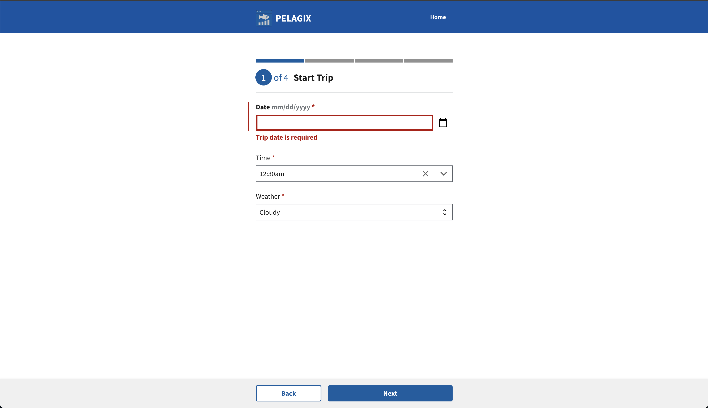
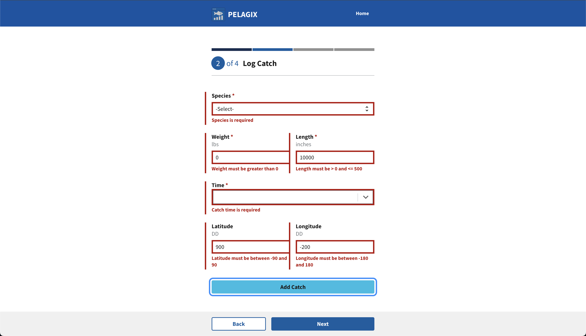

# Lesson 5: Form Validation

In this lesson, we will implement comprehensive form validation across all three steps of the trip logging process (Start Trip, Catch Log, and End Trip). This ensures users provide accurate, complete information before proceeding to each subsequent step. We'll add validation logic using React state management and display user-friendly error messages using USWDS `ErrorMessage` components.

## Step 1: Understanding Form Validation in RADFish Applications

Before implementing validation, let's understand the validation patterns used in RADFish applications and how they integrate with React state management.

### 1.1: Validation Architecture

Form validation in RADFish applications follows a consistent pattern across all form components:

1. **Validation Functions**: Pure functions that check field values against business rules
2. **Error State Management**: React state to store and display validation errors
3. **Submission Prevention**: Block navigation/submission when validation fails
4. **User Experience**: Clear, accessible error messages using USWDS components

### 1.2: Validation Types

Our trip logging application uses several validation types:

- **Required Field Validation**: Ensures essential fields are not empty
- **Data Type Validation**: Validates numbers, coordinates, and other specific formats
- **Range Validation**: Ensures numeric values fall within acceptable bounds
- **Business Logic Validation**: Custom rules specific to fishing trip data

**Key Validation Concepts:**

- **Client-Side Validation**: Immediate feedback without server round-trips
- **Accessible Error Messages**: Screen reader compatible with proper ARIA attributes
- **Form State Management**: Coordinating validation with React's controlled components
- **Progressive Enhancement**: Validation works even if JavaScript fails

## Step 2: Start Trip Form Validation

Let's begin by implementing comprehensive validation for the Start Trip form, which collects the trip date, start time, and weather conditions. We'll build this validation system from scratch, starting with importing validation utilities and building up to a complete validated form.

### 2.1: Import Validation Utilities

First, we need to import the validation utilities and constants that provide consistent validation logic across the application.

Open `src/pages/StartTrip.jsx` and add the validation imports to your existing import statements:

```jsx title="src/pages/StartTrip.jsx"
import { useApplication } from "@nmfs-radfish/react-radfish";
import {
  Button,
  DatePicker,
  Form,
  FormGroup,
  Label,
  Select,
  TimePicker,
} from "@trussworks/react-uswds";
import { Layout } from "../components/Layout";
//diff-remove-start
import { STORE_NAMES, COLLECTION_NAMES } from "../utils";
//diff-remove-end
//diff-add-start
import { validateRequired, FIELD_NAMES, STORE_NAMES, COLLECTION_NAMES } from "../utils";
//diff-add-end
```

**Understanding the Validation Imports:**

- **`validateRequired`**: A utility function that checks if a field has a value and returns an error message if not
- **`FIELD_NAMES`**: Constants that provide consistent field names for error messages (e.g., "Trip date", "Start weather")
- These utilities ensure consistent validation behavior and error messages across the entire application

### 2.2: Add Error State Management

Before we can implement validation, we need to add state to track validation errors and form submission status. Add these states after your existing `tripData` state:

```jsx title="src/pages/StartTrip.jsx"
// --- State Management ---
const [tripData, setTripData] = useState({
  tripDate: "",
  startWeather: "",
  startTime: "",
});

// Validation errors state - stores field-specific error messages
//diff-add-start
const [errors, setErrors] = useState({});
//diff-add-end

// Track if form has been submitted to show errors
//diff-add-start
const [submitted, setSubmitted] = useState(false);
//diff-add-end

const [isLoading, setIsLoading] = useState(false);
```

**Understanding the Error State:**

- **`errors`**: An object that will store validation error messages for each field (e.g., `{ tripDate: "Trip date is required" }`)
- **`setErrors`**: Function to update the error state when validation runs or when fields are corrected
- **`submitted`**: Boolean that tracks whether the user has attempted to submit the form (used to control when errors are displayed)
- **Initial State**: Empty object `{}` means no errors initially, and `false` for submitted means errors won't show until first submission attempt

### 2.3: Implement the validateForm Function

Now let's implement the `validateForm` function that will validate all three required fields in the Start Trip form. This function will use the imported validation utilities to check each field and return an errors object.

Add this function inside your `StartTrip` component, after the state declarations:

```jsx title="src/pages/StartTrip.jsx"
function StartTrip() {
  // ... existing state and hooks ...

  // --- Validation ---
  /**
   * Validates all form fields before submission
   * Uses centralized validation utilities for consistency
   * @param {Object} data - Form data to validate
   * @returns {Object} Validation errors object (empty if valid)
   */
    //diff-add-start
  const validateForm = (data) => {
    const newErrors = {};
    //diff-add-end

    // Validate each required field using centralized validators
    //diff-add-start
    const dateError = validateRequired(data.tripDate, FIELD_NAMES.DATE);
    if (dateError) newErrors.tripDate = dateError;

    const weatherError = validateRequired(
      data.startWeather,
      FIELD_NAMES.START_WEATHER,
    );
    if (weatherError) newErrors.startWeather = weatherError;

    const timeError = validateRequired(data.startTime, FIELD_NAMES.START_TIME);
    if (timeError) newErrors.startTime = timeError;

    return newErrors;
  };
  //diff-add-end
```

**Understanding the Validation Pattern:**

- **Centralized Validation**: Uses `validateRequired` utility for consistent validation logic
- **Field Constants**: `FIELD_NAMES.DATE`, `FIELD_NAMES.START_WEATHER`, etc. provide consistent error messages
- **Error Object**: Maps field names to error messages (e.g., `{ tripDate: "Trip date is required" }`)
- **Null Handling**: `validateRequired` returns `null` for valid fields, which doesn't add entries to the errors object
- **Empty Object**: Valid forms return `{}` which evaluates to no errors

### 2.4: Update handleSubmit with Validation

Now we need to update the `handleSubmit` function to use our validation logic. The form should validate all fields before attempting to save data and only proceed if there are no errors.

Locate the `handleSubmit` function and update it to include validation:

```jsx title="src/pages/StartTrip.jsx"
const handleSubmit = async (e) => {
  e.preventDefault();
  //diff-add-start
  setSubmitted(true); // Mark form as submitted to show errors
  //diff-add-end

  // Validate all form fields
  //diff-add-start
  const validationErrors = validateForm(tripData);
  setErrors(validationErrors);
  //diff-add-end

  // Only proceed if no validation errors
  //diff-add-start
  if (Object.keys(validationErrors).length === 0) {
  //diff-add-end
    try {
      const tripStore = app.stores[STORE_NAMES.TRIP_STORE];
      const tripCollection = tripStore.getCollection(COLLECTION_NAMES.TRIP_COLLECTION);

      const tripDataToSave = {
        tripDate: tripData.tripDate,
        startWeather: tripData.startWeather,
        startTime: tripData.startTime,
        status: "in-progress",
        step: 2,
      };

      let navigateToId = tripId;

      if (tripId) {
        await tripCollection.update({ id: tripId, ...tripDataToSave });
      } else {
        const newTripId = crypto.randomUUID();
        await tripCollection.create({
          id: newTripId,
          ...tripDataToSave,
        });
        navigateToId = newTripId;
      }
      navigateWithTripId("/catch", navigateToId);
    } catch (error) {
      console.error("Error saving trip data:", error, "Trip ID:", tripId);
    }
  //diff-add-start
  }
  //diff-add-end
};
```

**Understanding the Validation Flow:**

- **Validation First**: `validateForm(tripData)` runs before any database operations
- **Error State Update**: `setErrors(validationErrors)` updates the component state with any validation errors
- **Conditional Submission**: Only proceeds with save/navigation if `Object.keys(validationErrors).length === 0`
- **User Feedback**: Invalid forms show errors without attempting to save data
- **Smooth UX**: Valid forms proceed normally to the next step

### 2.5: Add Error States and Messages to Date Field

Now we'll implement complete validation display for the Date field. This includes adding error states to the FormGroup, Label, and input components, plus the ErrorMessage component to display the actual error text.

First, add the ErrorMessage import to your existing USWDS imports:

```jsx title="src/pages/StartTrip.jsx"
import {
  Button,
  DatePicker,
  //diff-add-start
  ErrorMessage,
  //diff-add-end
  Form,
  FormGroup,
  Label,
  Select,
  TimePicker,
} from "@trussworks/react-uswds";
```

Now update the Date field to include complete error handling:

```jsx title="src/pages/StartTrip.jsx"
//diff-remove-start
<FormGroup>
//diff-remove-end
//diff-add-start
<FormGroup error={submitted && errors.tripDate}>
//diff-add-end
  <Label
    htmlFor="tripDate"
    //diff-add-start
    error={submitted && errors.tripDate}
    //diff-add-end
    hint=" mm/dd/yyyy"
    className="input-date-label"
    requiredMarker
  >
    Date
  </Label>
  <DatePicker
    id="tripDate"
    name="tripDate"
    defaultValue={trip?.tripDate}
    onChange={handleDateChange}
    //diff-add-start
    validationStatus={submitted && errors.tripDate ? "error" : undefined}
    //diff-add-end
    //diff-remove-start
    aria-describedby="trip-date-hint"
    //diff-remove-end
    //diff-add-start
    aria-describedby="trip-date-hint trip-date-error-message"
    //diff-add-end
    required
  />
  <span id="trip-date-hint" className="usa-sr-only">
    Please enter or select the date of your fishing trip.
  </span>
  //diff-add-start
  {submitted && errors.tripDate && (
    <ErrorMessage id="trip-date-error-message" className="font-sans-2xs">
      {errors.tripDate}
    </ErrorMessage>
  )}
  //diff-add-end
</FormGroup>
```

**Understanding the Complete Validation Pattern:**

- **FormGroup Error State**: `error={submitted && errors.tripDate}` applies USWDS error styling to the entire field group
- **Label Error State**: `error={submitted && errors.tripDate}` makes the label text red when there's an error
- **Input Validation Status**: `validationStatus={submitted && errors.tripDate ? "error" : undefined}` adds a red border to the input
- **ARIA Accessibility**: `aria-describedby` now includes both the hint and error message IDs for screen readers
- **Conditional Error Message**: The ErrorMessage only renders when form is submitted AND an error exists
- **Consistent Styling**: `className="font-sans-2xs"` applies USWDS typography for error messages

### 2.6: Test Date Field Validation

Let's test that the Date field validation is working correctly before implementing the other fields:

1. **Navigate to the Start Trip page** (`/start`)
2. **Leave the Date field empty**
3. **Click the "Next" button**

**Expected Results:**
- The form should **not** navigate away
- The Date field should show a **red border**
- The Date field container should have a left **red border**
- The error message **"Trip date is required"** should appear below the field



**Test the Fix:**
- Now select a date in the Date field
- The error styling and message should disappear immediately
- The form will still not submit because other fields are empty (which is expected)

### 2.7: Apply Validation to Remaining Fields

Now that you understand the complete validation pattern, apply the same approach to the Time and Weather fields:

```jsx title="src/pages/StartTrip.jsx"
//diff-remove-start
<FormGroup>
//diff-remove-end
//diff-add-start
<FormGroup error={submitted && errors.startTime}>
//diff-add-end
  <Label
    htmlFor="startTime"
    //diff-add-start
    error={submitted && errors.startTime}
    //diff-add-end
    className="input-time-label"
    requiredMarker
  >
    Time
  </Label>
  <TimePicker
    id="startTime"
    name="startTime"
    defaultValue={trip?.startTime}
    onChange={handleTimeChange}
    minTime="00:00"
    maxTime="23:45"
    step={15}
    //diff-add-start
    className={submitted && errors.startTime ? "usa-input--error" : undefined}
    //diff-add-end
    //diff-remove-start
    aria-describedby="start-time-hint"
    //diff-remove-end
    //diff-add-start
    aria-describedby="start-time-hint start-time-error-message"
    //diff-add-end
  />
  <span id="start-time-hint" className="usa-sr-only">
    Please enter or select the time you started fishing.
  </span>
  //diff-add-start
  {submitted && errors.startTime && (
    <ErrorMessage id="start-time-error-message" className="font-sans-2xs">
      {errors.startTime}
    </ErrorMessage>
  )}
  //diff-add-end
</FormGroup>

//diff-remove-start
<FormGroup>
//diff-remove-end
//diff-add-start
<FormGroup error={submitted && errors.startWeather}>
//diff-add-end
  <Label
    htmlFor="startWeather"
    //diff-add-start
    error={submitted && errors.startWeather}
    //diff-add-end
    requiredMarker
  >
    Weather
  </Label>
  <Select
    id="startWeather"
    name="startWeather"
    value={trip?.startWeather}
    onChange={handleInputChange}
    //diff-add-start
    validationStatus={submitted && errors.startWeather ? "error" : undefined}
    //diff-add-end
    //diff-remove-start
    aria-describedby="start-weather-hint"
    //diff-remove-end
    //diff-add-start
    aria-describedby="start-weather-hint start-weather-error-message"
    //diff-add-end
  >
    <option value="">-Select-</option>
    <option value="Sunny">Sunny</option>
    <option value="Cloudy">Cloudy</option>
    <option value="Rainy">Rainy</option>
  </Select>
  <span id="start-weather-hint" className="usa-sr-only">
    Please select the weather conditions at the start of your fishing trip.
  </span>
  //diff-add-start
  {submitted && errors.startWeather && (
    <ErrorMessage id="start-weather-error-message" className="font-sans-2xs">
      {errors.startWeather}
    </ErrorMessage>
  )}
  //diff-add-end
</FormGroup>
```

:::note TimePicker Validation
Unlike DatePicker and Select, the TimePicker component doesn't support the `validationStatus` prop. Instead, use the `className` prop with the USWDS error class: `className={submitted && errors.startTime ? "usa-input--error" : undefined}`.
:::

### 2.8: Testing Complete Form Validation

To verify that your validation is working correctly, follow these steps to test the complete validation flow:

1. **Navigate to the Start Trip page** (`/start`) in your application
2. **Leave the Date field empty** - don't select or enter any date
3. **Fill in the other required fields** (Time and Weather) with valid values
4. **Click the "Next" button** to attempt form submission

**Expected Results:**

- ✅ The form should **not** navigate to the next page
- ✅ The Date field should display a **red border** (error styling)
- ✅ The error message **"Trip date is required"** should appear below the Date field in red text
- ✅ The label should also display in **red** to indicate the error state

**Additional Testing:**

- **Fill in the Date field** and submit again - the date error should disappear while other empty fields still show errors
- **Fill all fields correctly** - all errors should clear and the form should proceed to the Catch Log page
- **Test field clearing** - When you start typing in an invalid field, its error should clear immediately

**Validation Complete!** You've successfully implemented a complete validation system that:
- Uses centralized validation utilities for consistency
- Provides immediate visual feedback for invalid fields
- Blocks navigation until all required fields are valid
- Follows USWDS accessibility standards
- Integrates smoothly with the existing form structure

## Step 3: Catch Log Form Validation

The Catch Log page presents a more complex validation scenario with both a "new catch" form and a list of existing catches that can be edited. You'll implement comprehensive validation that includes required fields, numeric ranges, and coordinate validation.

### 3.1: Import Validation Utilities

First, we need to import the validation utilities from the utils module that provide comprehensive validation logic.

Open `src/pages/CatchLog.jsx` and add the validation imports to your existing import statements:

```jsx title="src/pages/CatchLog.jsx"
import {
  FIELD_NAMES,
  SPECIES_OPTIONS,
  TIME_PICKER_CONFIG,
  STORE_NAMES,
  COLLECTION_NAMES,
} from "../utils";
//diff-add-start
import {
  validateRequired,
  validateNumberRange,
  validateLatitude,
  validateLongitude,
  VALIDATION_RANGES,
} from "../utils";
//diff-add-end
```

**Understanding the Validation Imports:**

- **`validateRequired`**: Checks if required fields have values
- **`validateNumberRange`**: Validates numeric fields within specified ranges
- **`validateLatitude`** & **`validateLongitude`**: Validates coordinate fields
- **`VALIDATION_RANGES`**: Constants for validation ranges (weight 0-1000, length 0-500, etc.)
- **`FIELD_NAMES`**: Consistent field names for error messages

### 3.2: Implement Validation Functions

Now we need to add two validation functions: one for the new catch form and one for recorded catches. We'll implement these separately to make them easier to understand.

#### Add validateForm Function

First, let's add the validation function for the new catch form. This function validates the current catch data before adding it to the list.

Add this function inside your `CatchLog` component, after the state declarations:

```jsx title="src/pages/CatchLog.jsx"
// --- Validation Functions ---
/**
 * Validates new catch form data
 * @param {Object} data - Form data to validate
 * @returns {Object} Validation errors keyed by field name
 */
//diff-add-start
const validateForm = () => {
  const newErrors = {};
//diff-add-end

  // Validate required fields
  //diff-add-start
  const speciesError = validateRequired(currentCatch.species, FIELD_NAMES.SPECIES);
  if (speciesError) newErrors.species = speciesError;
  
  const weightError = validateRequired(currentCatch.weight, FIELD_NAMES.WEIGHT);
  if (weightError) newErrors.weight = weightError;
  
  const lengthError = validateRequired(currentCatch.length, FIELD_NAMES.LENGTH);
  if (lengthError) newErrors.length = lengthError;
  
  const timeError = validateRequired(currentCatch.time, FIELD_NAMES.TIME);
  if (timeError) newErrors.time = timeError;
  //diff-add-end

  // Validate ranges if value exists and required check passed
  //diff-add-start
  if (!newErrors.weight && currentCatch.weight) {
    const { min, max } = VALIDATION_RANGES.WEIGHT;
    const rangeError = validateNumberRange(currentCatch.weight, min, max, FIELD_NAMES.WEIGHT, false);
    if (rangeError) newErrors.weight = rangeError;
  }
  
  if (!newErrors.length && currentCatch.length) {
    const { min, max } = VALIDATION_RANGES.LENGTH;
    const rangeError = validateNumberRange(currentCatch.length, min, max, FIELD_NAMES.LENGTH, false);
    if (rangeError) newErrors.length = rangeError;
  }
  //diff-add-end

  // Validate coordinates if entered (optional fields)
  //diff-add-start
  if (currentCatch.latitude) {
    const latitudeError = validateLatitude(currentCatch.latitude);
    if (latitudeError) newErrors.latitude = latitudeError;
  }
  
  if (currentCatch.longitude) {
    const longitudeError = validateLongitude(currentCatch.longitude);
    if (longitudeError) newErrors.longitude = longitudeError;
  }
  
  return newErrors;
};
//diff-add-end
```

**Understanding validateForm:**

- **Required Field Validation**: Checks species, weight, length, and time are not empty
- **Range Validation**: Validates weight (0-1000) and length (0-500) are within acceptable bounds
- **Optional Coordinate Validation**: Only validates latitude/longitude if values are provided
- **Error Object**: Returns an object with field names as keys and error messages as values

#### Add validateRecordedCatches Function

Next, let's add the validation function for recorded catches. This function validates all catches in the list before allowing navigation to the next step.

Add this function right after the `validateForm` function:

```jsx title="src/pages/CatchLog.jsx"
/**
 * Validates all recorded catches
 * @returns {Object} Validation errors indexed by catch index
 */
//diff-add-start
const validateRecordedCatches = () => {
  const allErrors = {};
  
  catches.forEach((catchItem, index) => {
    const catchErrors = {};
    //diff-add-end

    // Validate required fields for each recorded catch
    //diff-add-start
    const speciesError = validateRequired(catchItem.species, FIELD_NAMES.SPECIES);
    if (speciesError) catchErrors.species = speciesError;
    
    const weightError = validateRequired(catchItem.weight, FIELD_NAMES.WEIGHT);
    if (weightError) catchErrors.weight = weightError;
    
    const lengthError = validateRequired(catchItem.length, FIELD_NAMES.LENGTH);
    if (lengthError) catchErrors.length = lengthError;
    
    const timeError = validateRequired(catchItem.time, FIELD_NAMES.TIME);
    if (timeError) catchErrors.time = timeError;
    //diff-add-end

    // Validate ranges if value exists and required check passed
    //diff-add-start
    if (!catchErrors.weight && catchItem.weight) {
      const { min, max } = VALIDATION_RANGES.WEIGHT;
      const rangeError = validateNumberRange(catchItem.weight, min, max, FIELD_NAMES.WEIGHT, false);
      if (rangeError) catchErrors.weight = rangeError;
    }
    
    if (!catchErrors.length && catchItem.length) {
      const { min, max } = VALIDATION_RANGES.LENGTH;
      const rangeError = validateNumberRange(catchItem.length, min, max, FIELD_NAMES.LENGTH, false);
      if (rangeError) catchErrors.length = rangeError;
    }
    //diff-add-end

    // Validate coordinates if entered
    //diff-add-start
    if (catchItem.latitude) {
      const latitudeError = validateLatitude(catchItem.latitude);
      if (latitudeError) catchErrors.latitude = latitudeError;
    }
    
    if (catchItem.longitude) {
      const longitudeError = validateLongitude(catchItem.longitude);
      if (longitudeError) catchErrors.longitude = longitudeError;
    }
    //diff-add-end

    // If there are errors for this catch, add them to the main error object
    //diff-add-start
    if (Object.keys(catchErrors).length > 0) {
      allErrors[index] = catchErrors;
    }
  });
  
  return allErrors;
};
//diff-add-end
```

**Understanding validateRecordedCatches:**

- **Iterates Through All Catches**: Uses `forEach` to validate each recorded catch
- **Same Validation Rules**: Applies identical validation logic as the new catch form
- **Indexed Errors**: Returns errors indexed by catch position (e.g., `{ 0: { species: "Species is required" }, 2: { weight: "Weight must be between 0 and 1000" } }`)
- **Sparse Object**: Only includes indices for catches with errors, making it easy to check if any errors exist

### 3.3: Add Recorded Catches Error State

Before implementing validation for the main form submission, we need to add state management for tracking validation errors in the recorded catches list.

Add the recorded catches error state after your existing state declarations:

```jsx title="src/pages/CatchLog.jsx"
// --- State Management ---
const [catchTimeKey, setCatchTimeKey] = useState(0);
const [currentCatch, setCurrentCatch] = useState({
  species: "",
  weight: "",
  length: "",
  latitude: "",
  longitude: "",
  time: "",
});
const [errors, setErrors] = useState({}); // For new catch form validation
//diff-add-start
const [recordedCatchErrors, setRecordedCatchErrors] = useState({}); // For recorded catches validation
//diff-add-end
```

**Understanding the Error State Structure:**

- **`errors`**: Manages validation errors for the new catch form (single object with field names as keys)
- **`recordedCatchErrors`**: Manages validation errors for recorded catches (nested object where keys are catch indices and values are error objects)
- **Example structure**: `{ 0: { species: "Species is required" }, 1: { weight: "Weight must be greater than 0" } }`

This separate state allows us to track validation errors for each individual recorded catch independently.

### 3.4: Update New Catch Form Submission

Now we'll update the `handleAddCatch` function to use our validation logic. Locate the `handleAddCatch` function and add validation before calling the `addCatch` hook:

```jsx title="src/pages/CatchLog.jsx"
const handleAddCatch = async (e) => {
  e.preventDefault();
  
  // Validate form before adding catch
    //diff-add-start
  const formErrors = validateForm();
  setErrors(formErrors);
  //diff-add-end

  // Only proceed if validation passes
  //diff-add-start
  if (Object.keys(formErrors).length === 0) {
  //diff-add-end
    try {
      const success = await addCatch(currentCatch);
      
      if (success) {
        // Reset form and increment key to force TimePicker re-render
        resetForm();
        setCatchTimeKey((prevKey) => prevKey + 1);
      } else {
        throw new Error("Failed to add catch");
      }
    } catch (error) {
      console.error("Error adding catch:", error);
    }
  //diff-add-start
  }
  //diff-add-end
};
```

### 3.5: Update Main Form Submission for Navigation

Finally, we need to add validation to the main form submission that handles navigation to the next step. This validates all recorded catches before allowing the user to proceed.

Locate the `handleSubmit` function and add recorded catches validation:

```jsx title="src/pages/CatchLog.jsx"
const handleSubmit = async (e) => {
  e.preventDefault();
  
  // Validate all recorded catches before proceeding
    //diff-add-start
  const recordedErrors = validateRecordedCatches();
  setRecordedCatchErrors(recordedErrors);
  //diff-add-end

  // Only proceed if no validation errors exist
  //diff-add-start
  if (Object.keys(recordedErrors).length === 0 {
  //diff-add-end
    try {
      // Update trip step
      const success = await updateTrip({ step: 3 });
      if (success) {
        navigateWithTripId("/end", tripId);
      } else {
        throw new Error("Failed to update trip step");
      }
    } catch (error) {
      console.error("Error updating trip step:", error, "Trip ID:", tripId);
    }
  //diff-add-start
  }
  //diff-add-end
};
```

**Understanding the Complete Validation System:**

The validation system you've implemented provides comprehensive validation including:

- **Range Validation**: Weight (0-1000 lbs) and length (0-500 inches) must be within realistic bounds
- **Coordinate Validation**: Latitude (-90 to 90) and longitude (-180 to 180) follow geographic standards  
- **Optional Field Handling**: Coordinates are validated only if values are provided
- **Required Field Validation**: Species, weight, length, and time are all required
- **Two-Level Validation**: Both new catch form and recorded catches list are validated

### 3.6: Apply Error Display to Species Field

Now let's apply the validation display pattern you learned from the Start Trip form to the Species field in the Catch Log. The validation logic is already implemented, but we need to add the visual error states.

**Note:** The `ErrorMessage` component has already been imported for you, and all other form fields in this component already have error validation set up. We'll focus on just the Species field as an example.
Locate the Species FormGroup and apply the same error display pattern from the Start Trip form:

```jsx title="src/pages/CatchLog.jsx"
//diff-remove-start
<FormGroup >
//diff-remove-end
//diff-add-start
<FormGroup error={errors.species}>
//diff-add-end
  <Label
    htmlFor="species"
    //diff-add-start
    error={errors.species}
    //diff-add-end
    requiredMarker
  >
    Species
  </Label>
  <Select
    id="species"
    name="species"
    value={currentCatch.species}
    onChange={handleInputChange}
    //diff-add-start
    validationStatus={errors.species ? "error" : undefined}
    aria-describedby="species-error-message"
    //diff-add-end
  >
    <option value="">-Select-</option>
    {SPECIES_OPTIONS.map((species) => (
      <option key={species} value={species}>
        {species}
      </option>
    ))}
  </Select>
  //diff-add-start
  <ErrorMessage id="species-error-message" className="font-sans-2xs">
    {errors.species}
  </ErrorMessage>
  //diff-add-end
</FormGroup>
```

### 3.7: Testing Complete Form Validation

When you submit the form with invalid data, you should see multiple validation errors:

- **Species is required** - When dropdown is left at "-Select-"
- **Weight must be greater than 0** - When weight is set to 0
- **Length must be > 0 and ≤ 500** - When length exceeds 500 inches
- **Catch time is required** - When no time is selected
- **Latitude must be between -90 and 90** - When latitude is invalid (like 900)
- **Longitude must be between -180 and 180** - When longitude is invalid (like -200)

All fields show red borders, red labels, and specific error messages below each input.



### 3.8: Recorded Catches Validation

The recorded catches list also has validation set up the same way as the new catch form. When you click "Next" to proceed to the End Trip page, all catches in the "Recorded Catches" list are validated using the same rules and error display patterns you've learned.

This validation is already implemented for you - it prevents navigation to the next step if any recorded catches have invalid data.

### 3.9: Error Display for Recorded Catches

The recorded catches list uses the same error display pattern, but with unique IDs for each catch item (like `recorded-species-0`, `recorded-species-1`, etc.). This is already implemented for you throughout the recorded catches section.

## Step 4: Apply Validation to End Trip (Practice Exercise)

Now it's your turn! Apply the validation patterns you've learned to the End Trip form. This form needs validation for the trip's end time and weather conditions before allowing users to review their complete trip data.

However, before we can add validation, we need to complete the End Trip form implementation since it's currently missing the required fields and components.

### 4.1: Update the Data Model

First, you need to enable the `endTime` and `endWeather` fields in the data model.

Your task is to add the `endTime` and `endWeather` fields to the trip model.

:::info Hint
Models are defined in `src/index.jsx`.
:::

:::warning Multi-Step Form Consideration
Since this is a multi-step form, you need to handle the fact that `endTime` and `endWeather` won't be available when the trip is first created in the StartTrip form.

**The Problem:** If you make these fields `required: true` in the model, the StartTrip form will fail validation when trying to create the initial trip record because these fields don't exist yet.

**The Solutions:**

1. **Option 1**: Make the fields optional in the model (`required: false`)
2. **Option 2**: Set them to empty strings when creating the initial trip

**Recommended Approach:** Use Option 2 and update the `Form.create()`:

```jsx title="src/pages/StartTrip.jsx"
// Look for the Form.create call around line 241 and update it to:
await Form.create({
  id: newTripId,
  ...tripData,
  //diff-add-start
  endTime: "",
  endWeather: "",
  //diff-add-end
});
```

This allows the trip to be created successfully at the start, and these fields will be populated later in the EndTrip form.
:::

### 4.2: Import Required Components

Open `src/pages/EndTrip.jsx` and add the missing component imports.

**Your task:** Add the necessary imports at the top of the file.

**Components you'll need:**
:::info Hint  
Look at `src/pages/StartTrip.jsx` to see what components are needed for:

- Time input field
- Weather dropdown
- Error message display
  :::

### 4.3: Add Form Fields to the Component

The End Trip form currently only has navigation buttons. You need to add the actual form fields.

**Fields to add:**

1. **End Time field** - similar to the startTime field in Start Trip
2. **End Weather field** - similar to the weather field in Start Trip

:::info Hint
You'll need:

- FormGroup with proper error state
- Label with required marker and error state
- Input component with validation status
- Conditional ErrorMessage component
  :::

### 4.4: Add Form State Management

You'll need to add state management for the form data and handle changes.

:::info Hint
You'll need to add the following:

- tripData state for storing field values
- handleTimeChange function for time picker
- handleSelectChange function for dropdowns
- Form initialization from database/localStorage
  :::

### 4.5: Implement Validation Logic

Finally, add the validation patterns you learned from the previous forms.

**For validation functions:**

:::info Hint

- Copy the validateRequired helper from `src/pages/StartTrip.jsx`
- Add validateForm function that checks both endTime and endWeather
- Use the same field constants pattern (FIELD_END_TIME, FIELD_END_WEATHER)
  :::

**For setting validation errors:**

:::info Hint

- Use the same pattern as Start Trip
- const newErrors = validateForm();
  :::

**For displaying error messages:**

:::info Hint

- Follow the same pattern as previous forms
- Remember to:
  - Add error prop to FormGroup
  - Add error prop to Label
  - Add validationStatus to the input component
  - Add conditional ErrorMessage component
  - Use proper aria-describedby for accessibility
    :::

## Step 5: Testing Complete Validation Flow

Test the validation system with both invalid and valid data to ensure it works correctly:

### 5.1: Complete Validation Test

1. **Start Trip (`/start`)**:

   - Try submitting empty form → verify error messages appear
   - Fill fields correctly → proceeds to Catch Log

2. **Catch Log (`/catch`)**:

   - Try "Add Catch" with empty fields → verify validation errors
   - Test invalid coordinates (latitude > 90) → verify range validation
   - Add valid catches → try "Next" with invalid recorded catches → verify list validation
   - Ensure all catches are valid → proceeds to End Trip

3. **End Trip (`/end`)**:
   - Try submitting without end time/weather → verify validation blocks navigation
   - Fill fields correctly → proceeds to Review page

**Expected Results:**

- ✅ Errors appear only after submission attempts
- ✅ Invalid data blocks navigation between steps
- ✅ Error styling applied consistently across all forms
- ✅ Valid data clears errors and allows progression

## Conclusion

You have successfully implemented comprehensive form validation across all three steps of the trip logging process!

**Key Benefits:**

- **Data quality**: Ensures complete, accurate trip information
- **User experience**: Clear guidance when data doesn't meet requirements
- **Accessibility**: Screen reader compatible with proper labeling
- **Progressive enhancement**: Validation works even if JavaScript fails

In the next lesson, we'll implement the review page where users can see all their trip data before final submission.
