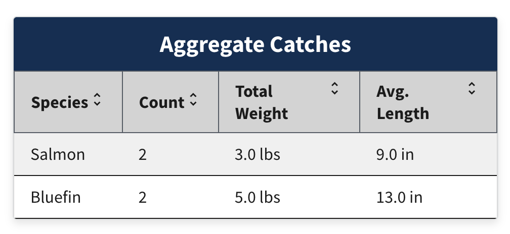
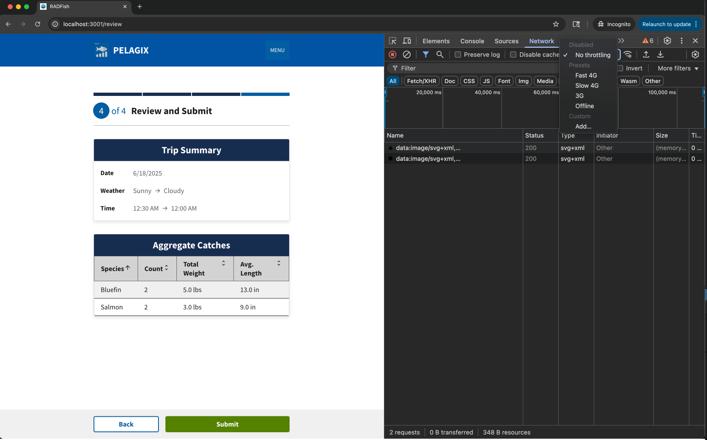
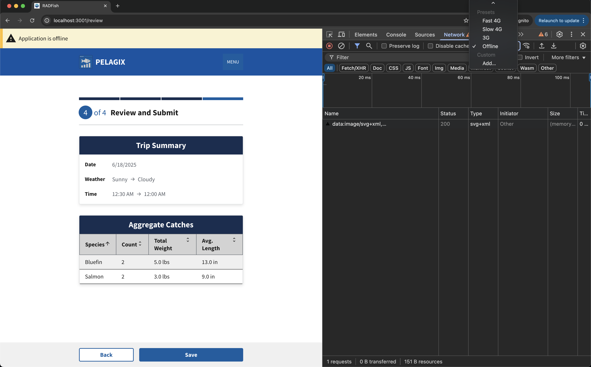

# Lesson 6: Computed Fields, Table Component, and Offline Detection

In this lesson, we will build a review page that fetches trip and catch data from RADFish stores, aggregates catch statistics by species, and displays the results using the RADFish Table component. We'll also implement offline detection using the `useOfflineStatus` hook to provide dynamic UI feedback based on network connectivity.

## Step 1: Access RADFish stores and fetch trip/catch data

We need to fetch the trip and catch data from their respective RADFish stores to display on the review page.

```jsx title="src/pages/ReviewSubmit.jsx" showLineNumbers=100
        //diff-add-start
        const tripStore = app.stores["trip"];
        const Form = tripStore.getCollection("Form");
        const Catch = tripStore.getCollection("Catch");

        const trips = await Form.find({ id: tripId });

        if (trips.length === 0) {
          setError(`Trip with ID ${tripId} not found`);
          navigate("/"); // Redirect home if trip doesn't exist
          return;
        }

        const selectedTrip = trips[0];
        setTrip(selectedTrip);

        const tripCatches = await Catch.find({ tripId: selectedTrip.id });
        //diff-add-end
```

**Understanding the Data Fetching Process:**

The highlighted code demonstrates the core data access pattern in RADFish applications:

1. **Store Access**: `app.stores["trip"]` gets the RADFish store that contains our trip and catch data
2. **Collection References**: We obtain references to both the `Form` (trip data) and `Catch` (individual catch records) collections
3. **Trip Lookup**: `Form.find({ id: tripId })` searches for the specific trip using the ID passed from the previous page
4. **Error Handling**: If no trip is found, we set an error message and redirect to prevent displaying invalid data
5. **Data Storage**: The found trip is stored in React state (`setTrip`) for use throughout the component
6. **Related Data**: `Catch.find({ tripId: selectedTrip.id })` fetches all catch records that belong to this trip

This pattern ensures we have all the necessary data loaded before attempting to display the review page.

## Step 2: Call the aggregation function

After fetching the raw catch data, we need to process it to calculate summary statistics for display. This involves grouping catches by species and calculating totals and averages.

```jsx title="src/pages/ReviewSubmit.jsx" showLineNumbers=100
        //diff-add-start
        const aggregatedData = aggregateCatchesBySpecies(tripCatches);
        setAggregatedCatches(aggregatedData);
        //diff-add-end
```

**Understanding the Data Aggregation Process:**

1. **Function Call**: `aggregateCatchesBySpecies(tripCatches)` processes the array of individual catch records
2. **Data Grouping**: The helper function groups catches by species (e.g., all "Bass" catches together)
3. **Statistical Calculations**: For each species, it calculates:
   - **Total Count**: How many fish of this species were caught
   - **Total Weight**: Combined weight of all fish of this species  
   - **Average Length**: Mean length across all fish of this species
4. **State Update**: `setAggregatedCatches(aggregatedData)` stores the processed data in React state

This aggregation transforms individual catch records like:
```
Bluefin:  2 lbs,  12 in
Bluefin:  3 lbs,  14 in  
Salmon:   1 lb,   8 in
Salmon:   2 lbs,  10 in
```

Into summary data like:
```
Bluefin:  Count=2, Total Weight=5 lbs, Avg Length=13 in
Salmon:   Count=2, Total Weight=3 lbs, Avg Length=9 in
```

## Step 3: Use the RADFish Table component to display aggregated data

Now that we have the aggregated catch data, we will use the RADFish `Table` component to display it in a structured and user-friendly way.


```jsx title="src/pages/ReviewSubmit.jsx" showLineNumbers=100
        //diff-add-start
                <Table
                  // Map aggregated data to the format expected by the Table component
                  data={aggregatedCatches.map((item, index) => ({
                    id: index, // Use index as ID for the table row
                    species: item.species,
                    count: item.count,
                    totalWeight: `${item.totalWeight} lbs`, // Add units
                    avgLength: `${item.avgLength} in`, // Add units
                  }))}
                  // Define table columns: key corresponds to data keys, label is header text
                  columns={[
                    { key: "species", label: "Species", sortable: true },
                    { key: "count", label: "Count", sortable: true },
                    { key: "totalWeight", label: "Total Weight", sortable: true },
                    { key: "avgLength", label: "Avg. Length", sortable: true },
                  ]}
                  // Enable striped rows for better readability
                  striped
                />
        //diff-add-end
```

**Understanding the RADFish Table Component:**

The highlighted code demonstrates how to use the RADFish `Table` component for displaying structured data:

1. **Data Transformation**: The `data` prop maps over `aggregatedCatches` to format it for table display:
   - **Row IDs**: Each row gets a unique `id` (using array index)
   - **Unit Labels**: Weight and length values get proper units (`lbs`, `in`)
   - **Clean Formatting**: Data is structured to match the table's expected format

2. **Column Configuration**: The `columns` prop defines the table structure:
   - **Key Mapping**: Each column's `key` matches a property in the data objects
   - **Header Labels**: `label` sets the user-friendly column header text
   - **Sorting**: `sortable: true` enables click-to-sort functionality for each column

3. **Visual Enhancement**: `striped` prop adds alternating row colors for easier reading


This creates a professional, sortable data table that users can interact with to review their trip's catch summary.



## Step 4: Testing Offline Functionality

Now let's test how the application automatically adapts to network changes using RADFish's offline detection capabilities.

### 4.1: Understanding Offline Detection

The Review page uses RADFish's `useOfflineStatus` hook to detect network changes and adapt the UI accordingly.

```jsx title="src/pages/ReviewSubmit.jsx" showLineNumbers=5
import {
  useApplication,
  Table,
  //diff-add-start
  useOfflineStatus,
  //diff-add-end
} from "@nmfs-radfish/react-radfish";

function ReviewSubmit() {
  const navigate = useNavigate();
  const location = useLocation();
  const app = useApplication();
  //diff-add-start
  const { isOffline } = useOfflineStatus();
  //diff-add-end
```

**Button Display Logic:**

```jsx title="src/pages/ReviewSubmit.jsx" showLineNumbers=200
if (isOffline) {
  //diff-add-start
  defaultProps.nextLabel = "Save";
  //diff-add-end
} else {
  //diff-add-start
  defaultProps.nextLabel = "Submit";
  defaultProps.nextButtonProps = { className: "bg-green hover:bg-green" };
  //diff-add-end
}
```

**Submission Logic:**

```jsx title="src/pages/ReviewSubmit.jsx" showLineNumbers=220
//diff-add-start
const finalStatus = isOffline ? "Not Submitted" : "submitted";
//diff-add-end

await Form.update({ id: trip.id, status: finalStatus, step: 4 });

//diff-add-start
navigate(isOffline ? "/offline-confirm" : "/online-confirm");
//diff-add-end
```

**Summary:**
- **Online**: Green "Submit" button → `status: "submitted"` → `/online-confirm`
- **Offline**: Blue "Save" button → `status: "Not Submitted"` → `/offline-confirm`

### 4.2: Test Development Mode

1. **Start the development server**: `npm run start`
2. **Navigate to the Review page** after completing a trip
3. **Open Developer Tools** (F12) → Network tab
4. **Toggle between "No throttling" and "Offline"** in the network dropdown
5. **Observe the button changes**:
   - **Online**: Green "Submit" button
   
   - **Offline**: Blue "Save" button
   


### 4.3: Test Production Mode

1. **Build the application**:
   ```bash
   npm run build
   ```

2. **Serve the production build**:
   ```bash
   npm run serve
   ```

3. **Test offline functionality**:
   - Complete a trip and navigate to Review page
   - Toggle offline/online in dev tools
   - Reload the page while offline - it should still work
   - Submit a trip while offline - it saves locally as "Not Submitted"


## Conclusion

In this lesson, you learned how to fetch data from multiple RADFish stores, perform data aggregation, and display the results using the RADFish `Table` component. You also implemented offline detection using the `useOfflineStatus` hook.

**Key Accomplishments:**
- **Data Integration**: Fetched and aggregated trip and catch data from multiple RADFish stores
- **Table Display**: Used the RADFish Table component to present aggregated catch data
- **Offline Detection**: Implemented dynamic UI changes based on network status using `useOfflineStatus`
- **Production Testing**: Tested offline functionality in both development and production builds

Your RADFish application now provides a complete offline-capable experience with clear visual feedback for users.